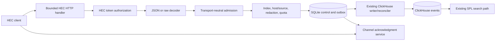

# Open Splunk HTTP Event Collector Compatibility Plan

**Status:** Implemented release candidate; default-off capability

**Date:** August 10, 2026

**Compatibility target:** A bounded, documented subset of Splunk Enterprise
HTTP Event Collector behavior for the single-node Open Splunk product

**Estimated effort:** 8–12 engineer-weeks for one production-ready vertical

## Executive summary

Open Splunk already has a durable native ingestion path: authenticated
collectors send typed protobuf batches over bidirectional gRPC, the server
revalidates token and index authority, validates and redacts events, charges
durable quotas, stages a replayable ClickHouse write, and acknowledges only the
promised durability outcome. HTTP Event Collector (HEC) compatibility should
reuse those guarantees while exposing the HTTP and JSON protocol expected by
existing Splunk-oriented producers.

This is not a plan for a thin JSON-to-protobuf endpoint. HEC has its own token
purpose, metadata precedence, JSON event framing, raw-event behavior, channel
identity, indexer acknowledgments, response taxonomy, health signals, and
resource-exhaustion semantics. Treating an HTTP request as a fake collector
stream would couple unrelated lifecycle models, misrepresent HEC clients in the
collector fleet, and weaken durable retry and quota invariants.

The implementation should instead:

1. extract a transport-neutral durable ingestion-admission core from the native
   collector service without changing the native wire contract;
2. add an explicit HEC token purpose and bounded HEC defaults to the existing
   ingestion-token control plane;
3. implement the JSON event, raw event, acknowledgment, and health endpoints;
4. stage every accepted request durably before returning success;
5. map HEC channel acknowledgment IDs to the existing ClickHouse outbox and
   visibility lifecycle;
6. retain truthful ingestion-source provenance without inventing collector
   fleet identities;
7. publish operational metrics and audit administrative mutations without
   logging secrets or payloads; and
8. prove the full path from an HTTPS HEC request to an SPL-searchable event.

At the repository's current correctness and adversarial-testing standard, the
complete vertical is expected to take **8–12 engineer-weeks**. One experienced
engineer should plan on roughly **two to three calendar months**. A small team
can parallelize protocol fixtures, control-plane work, and endpoint tests, but
the shared admission and acknowledgment authority must have one coherent
owner.

## Relationship to the product plan

The main [product and architecture plan](product-architecture-plan.md) already
defines two ingestion surfaces:

- the native protobuf/gRPC service used by the first-party collector; and
- a later compatibility facade shaped like Splunk HTTP Event Collector.

HEC-compatible endpoints are a Phase 3 multi-app product deliverable. The
native path was intentionally scheduled first so the compatibility facade could
reuse a reliable authorization, validation, quota, storage, and recovery
foundation rather than define the product's internal event model.

This plan preserves the existing architectural decisions:

- SQLite remains the single-node control-plane and durable admission authority.
- Checked-in SQL migrations remain the only production schema authority;
  `AutoMigrate` is not used.
- ClickHouse remains the event store and analytical execution engine.
- HEC clients never receive ClickHouse credentials and never submit SQL.
- Browser administration continues to use SRouter routes with protobuf
  request and response messages.
- Existing ingestion tokens remain the secret-storage and index-authorization
  foundation.
- The native collector's protobuf/gRPC contract and
  `ACK_DURABILITY_CLICKHOUSE_COMMITTED` promise do not change.
- Unsupported HEC syntax or behavior fails explicitly rather than being
  silently approximated.

## Relationship to knowledge-object work

HEC is intentionally an ingestion-side program. Knowledge objects operate
after storage, during search admission, planning, execution, inspection, and
retention. The two programs should not share implementation ownership.

The HEC workstream owns:

- HEC compatibility and deployment documentation;
- `internal/hec` parsing, response, service, and acknowledgment code;
- transport-neutral ingestion admission under `internal/ingest`;
- HEC-specific token administration extensions;
- additive SQLite and ClickHouse ingestion migrations;
- HEC server composition and operational metrics; and
- HEC-focused unit, migration, integration, and load tests.

The knowledge-object workstream owns:

- knowledge definitions, catalog resolution, and snapshots;
- SPL parsing and knowledge-plan injection;
- query compilation and execution;
- knowledge-aware inspection, history, export, and field discovery; and
- Knowledge Manager browser surfaces.

Shared seams should be limited to additive migration numbering, build-feature
advertisement, and final `cmd/open-splunk-server` composition. HEC
implementation must not modify `internal/queryexec`, SPL planning, search jobs,
knowledge protobufs, or Knowledge Manager components.

## Goals

The first production HEC release should:

- accept common Splunk HEC JSON event producers without the Open Splunk
  collector;
- preserve the canonical Open Splunk event model and typed dynamic fields;
- enforce token, index, host, source, retention, redaction, and rate policy at
  the same protected boundary as native ingestion;
- durably stage accepted HTTP requests before reporting success;
- support bounded raw-event ingestion with a documented fixed event breaker;
- support channel-scoped indexer acknowledgment with restart-safe state;
- return stable Splunk-shaped HTTP and JSON results for supported cases;
- distinguish HEC producers from native collector fleet identities;
- keep HEC retries at-least-once and never promise global exactly-once
  delivery;
- provide useful health, capacity, and per-token operational metrics;
- fail closed on corrupt control-plane, outbox, or acknowledgment state;
- retain compatibility fixtures for every supported request and response; and
- prove end-to-end searchability through the existing SPL engine and browser
  result path.

## Non-goals for HEC v0.1

The following are outside the first HEC release:

- exact compatibility with every historical Splunk Enterprise or Splunk Cloud
  HEC version;
- Splunk management-port paths such as
  `/servicesNS/.../data/inputs/http/...`;
- accepting administrator credentials or Basic authentication on ingestion
  endpoints;
- query-string token authentication;
- arbitrary `props.conf` or `transforms.conf` parsing;
- arbitrary multiline and timestamp-breaking rules;
- ingest-time field transforms, routing expressions, or custom scripts;
- metrics-specific HEC protocol extensions unless separately specified;
- HEC-to-indexer forwarding or output groups;
- distributed acknowledgment state or search-head/indexer clustering;
- global exactly-once event delivery;
- using HEC channels as user identities, tenant selectors, or index authority;
- exposing request bodies, raw events, field values, tokens, or token digests in
  audit records or ordinary logs; and
- making search-time knowledge publication a prerequisite for HEC ingestion.

## Current foundation

### Reusable token and policy behavior

The existing ingestion-token control plane already provides:

- random plaintext credentials shown exactly once;
- persisted credential digests and safe operator-visible prefixes;
- active, disabled, expired, and revoked states;
- explicit allowed-index membership;
- immutable native collector binding;
- optional full-value host and source RE2 constraints;
- per-token rate limits;
- bounded list/get/update/revoke APIs;
- optimistic versioning and idempotent create requests;
- last-use tracking; and
- atomic successful-mutation audit.

HEC should extend this model with an immutable token purpose and HEC defaults.
It should not create a second credential table or a second hashing scheme.

### Reusable event admission behavior

`internal/ingest` already provides:

- bounded event and batch limits;
- typed event normalization;
- mandatory and configured redaction;
- index, host, and source authorization;
- event-time bounds and future-skew policy;
- per-index retention snapshots;
- durable token and index quota charging;
- partial native-batch event rejection;
- durable batch identities and terminal replay; and
- retryable versus permanent storage error classification.

The HEC adapter should reuse the event-level validator and policy compiler. The
stream/session state machine is native-collector-specific and should remain
outside the HEC path.

### Reusable storage behavior

The ClickHouse writer already provides:

- a SQLite-backed outbox and visibility reservation;
- stable insert payloads and deduplication tokens;
- restart and ambiguous-send reconciliation;
- exact per-index retention metadata;
- typed JSON storage and field-discovery metadata;
- a committed visibility cutoff for search admission; and
- terminal replay within a bounded retention horizon.

HEC acknowledgments should be joined to this authority. A second direct
ClickHouse insert path would create incompatible visibility, backup, retry,
quota, and shutdown behavior.

### Pre-implementation gaps closed by HEC v0.1

At plan inception, the code did not provide the following capabilities. The
implemented release candidate now closes each gap through the phases and
acceptance gates below:

- a transport-neutral request admission API;
- HEC token purpose and metadata defaults;
- `Authorization: Splunk` parsing;
- bounded streaming JSON-envelope decoding;
- raw body event breaking;
- HEC response codes and `invalid-event-number` behavior;
- channel validation and isolation;
- durable acknowledgment allocation, query, and expiry;
- HEC producer provenance in stored events;
- HEC health and capacity reporting; or
- an HEC end-to-end integration corpus.

## Terminology

- **Native collector:** The first-party Open Splunk collector using the
  bidirectional protobuf/gRPC protocol.
- **HEC client:** An external process sending events through the HEC-compatible
  HTTP surface.
- **Ingestion source:** The trusted server-derived identity category and stable
  identifier responsible for an admitted request. Its kinds initially include
  native collector and HEC token.
- **HEC token:** An ingestion token whose immutable purpose permits the HEC
  surface and forbids native collector stream admission.
- **Channel:** A bounded client-supplied identifier used only to partition HEC
  acknowledgment allocation and queries within one token.
- **Acknowledgment ID:** A server-allocated opaque exact positive JSON integer
  scoped to one tenant, HEC token, and channel.
- **Durable staging:** Atomic SQLite admission of the request identity, quota
  charge, visibility reservation, immutable normalized payload, and optional
  acknowledgment row before HTTP success.
- **Indexed:** The state reached after the immutable staged payload has been
  committed to ClickHouse and its visibility reservation is committed.
- **JSON event endpoint:** The HEC surface that accepts one or more JSON event
  envelopes containing an `event` member.
- **Raw endpoint:** The HEC surface that accepts an unwrapped UTF-8 request body
  and derives events through the documented v0.1 breaker.
- **Compatibility fixture:** A complete request plus expected HTTP status,
  response body, durable disposition, and searchable stored-event projection.

## Compatibility posture

HEC compatibility must be a written executable contract, not a route-name
claim. Phase HEC-0 must create `docs/hec-compatibility-v0.1.md` before a
production route is registered.

The contract must define:

- accepted paths, methods, content types, and encodings;
- authentication grammar and token-purpose isolation;
- JSON framing, duplicate-member handling, number precision, and unknown
  members;
- `event`, `time`, `host`, `source`, `sourcetype`, `index`, and `fields`
  semantics;
- request, token, index, and deployment metadata precedence;
- absent, null, empty, and wrong-type behavior;
- raw-event breaking and final-line behavior;
- channel syntax, scoping, and case sensitivity;
- acknowledgment allocation, query, expiry, and restart semantics;
- request atomicity and `invalid-event-number` behavior;
- compression and decompression limits;
- HTTP status, HEC code, text, and optional response fields;
- rate-limit and capacity behavior;
- shutdown behavior;
- token update, disable, expiry, and revocation boundaries;
- duplicate request and retry behavior;
- every intentional Open Splunk deviation; and
- response and payload size bounds.

Public Splunk documentation is sufficient for the common envelope, documented
metadata, endpoint names, acknowledgment concept, and response taxonomy. It
does not specify every duplicate-key, numeric, partial-acceptance, raw-breaking,
and race boundary. Ambiguous cases require either:

1. a result from a legally available licensed Splunk differential oracle; or
2. an explicit Open Splunk behavior documented as a deviation.

The implementation must never start or accept a licensed Splunk image, legal
agreement, or paid service on a user's behalf merely to obtain an oracle.

## Selected HEC v0.1 surface

The compatibility contract may narrow this table when differential evidence
requires it, but it must not silently broaden it.

| Method | Path | v0.1 intent |
| --- | --- | --- |
| `POST` | `/services/collector` | Alias of the JSON event endpoint |
| `POST` | `/services/collector/event` | JSON event envelopes |
| `POST` | `/services/collector/event/1.0` | Versioned JSON endpoint alias |
| `POST` | `/services/collector/raw` | Bounded raw UTF-8 events |
| `POST` | `/services/collector/raw/1.0` | Versioned raw endpoint alias |
| `POST` | `/services/collector/ack` | Channel-scoped acknowledgment query |
| `GET` | `/services/collector/health` | Bounded service health result |
| `GET` | `/services/collector/health/1.0` | Versioned health alias |

Unsupported methods return a stable method error and do not fall through to
the browser SPA. Unknown `/services/collector/...` paths return a JSON HEC
error, not HTML.

The first release mounts these routes on the existing Open Splunk HTTPS
listener. Producers configure the full URL and are not entitled to a dedicated
port. A separate `8088` listener, separate certificate identity, or independent
HEC enable switch can follow only after deployment demand justifies the extra
startup, shutdown, firewall, and certificate lifecycle.

## Target architecture



The HTTP handler owns protocol adaptation only. It cannot select a tenant,
authorize an index, calculate retention, charge a quota, or write directly to
ClickHouse.

## Token and control-plane model

### Immutable token purpose

Add an immutable token-purpose enum:

```text
INGESTION_TOKEN_PURPOSE_NATIVE_COLLECTOR
INGESTION_TOKEN_PURPOSE_HEC
```

Creation requires one explicit purpose. Upgrade migration backfills every
existing token as `NATIVE_COLLECTOR`.

Purpose rules are closed:

- a native token requires its existing immutable `bound_collector_id`;
- an HEC token forbids `bound_collector_id`;
- a native token is rejected at every HEC endpoint;
- an HEC token is rejected during gRPC collector admission;
- purpose cannot be changed by update, disable, expiry, or recovery; and
- list/get responses expose purpose without exposing a secret.

This prevents a leaked compatibility credential from opening a collector
stream and prevents a native collector credential from being replayed through
a less stateful HTTP surface.

### HEC token profile

An HEC token owns a bounded profile:

```text
default_index_name       optional; must be in allowed_index_names
default_host             optional
default_source           optional
default_sourcetype       optional
indexer_acknowledgment  boolean
```

The purpose and acknowledgment mode are immutable after creation in v0.1.
Making acknowledgment mutable would create ambiguous behavior for in-flight
channels and retained acknowledgment IDs. Operators rotate to a new token to
change it.

The other defaults may be updated with the existing optimistic version and
audit transaction. A protected HEC request resolves one complete fresh token
snapshot. An update affects only a request which has not crossed durable
admission.

The implemented bounds are:

- host, source, and sourcetype: 1–255 UTF-8 bytes when present;
- default index: the existing canonical index-name contract;
- allowed indexes: the existing bounded nonempty token membership; and
- no NUL, surrounding whitespace normalization, or secret substitution in
  defaults.

Authored host, source, and sourcetype reject leading or trailing ASCII
whitespace without trimming. Interior whitespace and non-ASCII edge whitespace
are preserved, and the exact authorized value is staged.

### Administration API and UI

Extend the existing ingestion-token protobuf definitions rather than creating
a Splunk management-port emulation. The browser administrator should be able
to:

- choose Native Collector or HEC at creation;
- configure allowed indexes and optional HEC defaults;
- enable acknowledgment only at HEC-token creation;
- copy the plaintext token once;
- see token purpose, acknowledgment mode, state, last use, and safe prefix;
- update mutable defaults and existing rate/host/source constraints;
- disable or revoke the token through existing state operations; and
- obtain a curl example that contains no token after the creation dialog is
  dismissed.

The administrator UI is part of the complete HEC release, but it should be
implemented in existing token panels, not the Knowledge Manager.

### Successful audit

HEC token create, update, and revoke use the existing `ingestion_token.*`
successful-audit taxonomy. The token target version remains authoritative.
The audit record does not contain purpose-specific defaults, acknowledgment
mode, channel IDs, token prefix, or request statistics.

High-volume ingestion requests are operational events, not successful
administrator mutations. They must not append one SQLite audit row per request.

## Authentication boundary

The HEC handler accepts exactly:

```text
Authorization: Splunk <plaintext-token>
```

The contract must pin ASCII case behavior for the scheme using an oracle or an
explicit deviation. The implementation should initially require the exact
scheme spelling `Splunk` and exactly one separating ASCII space.

The handler rejects:

- missing, repeated, comma-joined, or malformed authorization headers;
- empty or whitespace-bearing credentials;
- Basic, Bearer, and browser-administrator credentials;
- query-string authorization;
- native-purpose ingestion tokens;
- inactive, expired, or revoked HEC tokens; and
- credentials without any current ingestion-enabled index authority.

Authentication failure responses never distinguish an unknown token from a
wrong-purpose token. Disabled and expired behavior may use distinct public HEC
codes only where the existing token store can make that distinction without
creating a credential oracle.

The plaintext token must be removed from reusable request state before the
decoder, admission service, metrics labels, or logger receives control.

## JSON event endpoint

### Streaming decode

The decoder must read through a hard-limited and optionally decompressing
reader. It cannot call an unbounded `io.ReadAll`, decode through `map[string]any`
with `float64` numbers, or materialize both compressed and decompressed copies.

The v0.1 framing target is a whitespace-separated sequence of complete JSON
objects. Each top-level object is one HEC event envelope. Array framing remains
unsupported unless the compatibility oracle shows it is necessary for the
selected target and the same resource bounds can be retained.

The decoder must:

- retain numbers as exact JSON lexical tokens;
- reject invalid UTF-8 outside JSON escape sequences;
- detect duplicate envelope members rather than silently taking first or last;
- reject trailing non-whitespace after the final envelope;
- count source bytes, decompressed bytes, envelopes, fields, nesting, and
  conservative normalized output incrementally;
- stop at the first deterministic error; and
- never expose an event body in its public diagnostic.

### Envelope members

The recognized members are:

```json
{
  "time": 1786323296.123456789,
  "host": "api-01",
  "source": "/var/log/example.log",
  "sourcetype": "example:json",
  "index": "main",
  "event": {"message": "request complete"},
  "fields": {"status": 200, "route": "/api/items"}
}
```

`event` is required. The contract must separately define JSON null, an empty
string, empty object, and empty array. A missing member and a present null are
never conflated by the decoder.

Unknown top-level members should be rejected in v0.1. Silently accepting a
misspelled `sourcetype` or `index` would route data incorrectly. A later
compatibility mode may retain documented Splunk behavior if differential tests
show that producers depend on ignored extensions.

### Event conversion

The adapter converts each envelope into the canonical `LogEvent` domain:

- a string `event` becomes exact UTF-8 `_raw` and may populate `message` under
  the explicit compatibility contract;
- an object or array becomes deterministic compact JSON `_raw` without
  promoting members implicitly into `fields`;
- a Boolean or exact JSON number becomes its deterministic JSON spelling in
  `_raw`;
- binary raw values are not accepted by the JSON endpoint;
- `fields`, not the `event` object, provides explicit dynamic fields; and
- the server assigns event ID, collected/received time, ingestion-source
  provenance, index time, visibility sequence, and expiry.

The JSON canonicalizer must preserve object member order only if that is part
of the selected compatibility contract. It must never round an integer or
fraction through IEEE-754 merely to generate `_raw`.

### Fields

`fields` is optional and must be a JSON object. The initial bounded value domain
should accept strings, exact integers, finite decimals, Booleans, null, and
flat arrays of those scalar values. Nested objects and nested arrays are
rejected for HEC v0.1 even though native protobuf events support a wider typed
domain.

Field names pass the existing canonical dynamic-path segment policy. The
adapter converts accepted values directly into protobuf `TypedValue` messages
and then delegates all field count, depth, metadata amplification, and index
policy enforcement to the existing validator.

The compatibility contract must record that Open Splunk preserves supported
typed field values instead of coercing every HEC field to a string.

### Time

An explicit `time` accepts only an exact JSON number or a string containing the
same bounded decimal epoch-seconds grammar. It is converted to UTC nanoseconds
without `float64` and must fit the existing ClickHouse and event-age/future-skew
intersection.

Absent `time` uses the request's single captured receive boundary. HEC v0.1
does not guess a timestamp from raw text or the `event` body. That is an
intentional deviation until a sourcetype-specific timestamp contract exists.

All envelopes in one request use the same captured receive time for defaulting,
policy validation, quota scheduling, and error precedence.

### Metadata precedence

The implemented order is:

```text
event envelope value
  > HEC token default
  > active index default where applicable
  > fixed Open Splunk HEC fallback
```

The compatibility contract must name every fallback. Index selection is never
implicit authority: the resolved index still must be a current allowed,
active, ingestion-enabled index.

No header other than the channel header may override event metadata in v0.1.

## Raw endpoint

### Fixed breaker

Open Splunk does not have an ingest-time `props.conf` execution engine. HEC v0.1
therefore uses one fixed, documented breaker:

- request bodies must be valid UTF-8;
- LF terminates an event;
- one CR immediately before LF is excluded from `_raw`;
- a final nonempty unterminated segment is an event;
- empty segments are either rejected or skipped exactly as fixed by HEC-0;
- the body cannot begin or end an event across HTTP requests; and
- each resulting event must fit the ordinary event limit.

Arbitrary timestamp recognition, multiline joining, regex line breakers, and
sourcetype configuration are deferred.

### Raw metadata

The raw endpoint accepts only the documented query parameters selected by
HEC-0 from:

```text
time
host
source
sourcetype
index
channel
```

Duplicate parameters, empty names, unsupported parameters, and conflicting
header/query channel values fail closed. Query values use the same validation,
precedence, authorization, and privacy rules as JSON-envelope values.

The raw endpoint does not accept a `fields` query parameter. Dynamic fields
require the JSON event endpoint.

## Request atomicity

The HTTP compatibility response cannot express the native protocol's detailed
per-event accepted, duplicate, and rejection lists. Silent partial admission is
therefore unsafe for v0.1.

The implemented Open Splunk contract is request-atomic:

- the complete envelope sequence or raw body is decoded and validated within
  bounded resources;
- the first deterministic invalid event produces `invalid-event-number` where
  that response member applies;
- no quota, acknowledgment, outbox, visibility, or ClickHouse row is created
  when any event is invalid or unauthorized; and
- one accepted request stages every event atomically.

If a licensed differential oracle proves common Splunk clients require prefix
admission before a later invalid event, HEC-0 must make the product decision
explicit. The implementation must not guess or allow a parser accident to
decide partial persistence.

## Transport-neutral ingestion admission

### Required refactor

Extract the shared work currently embedded in the collector stream service
into an API shaped conceptually like:

```go
type AdmissionRequest struct {
    Source         IngestionSource
    Authorization Authorization
    RequestID      string
    SourceDigest   [32]byte
    ReceivedAt     time.Time
    Events         []*LogEvent
    Acknowledgment *AcknowledgmentReservation
}

type AdmissionResult struct {
    DurableIdentity StoreBatchIdentity
    AcceptedEvents  uint32
    State           AdmissionState
    Acknowledgment *AcknowledgmentReference
}
```

The exact Go types are implementation details. The semantic separation is not:

1. transport parsing and authentication;
2. fresh authority resolution;
3. event normalization and redaction;
4. request-atomic policy and quota admission;
5. durable outbox and visibility staging;
6. ClickHouse reconciliation; and
7. transport-specific response adaptation.

The native collector continues to own hello negotiation, stream sequence,
session/fleet lease, heartbeat, takeover, and terminal batch-response replay.
HEC owns none of those concepts.

### Native regression boundary

The refactor is acceptable only if the existing native tests prove unchanged:

- collector binding and lease checks;
- fresh-policy revalidation;
- partial native event rejection;
- durable batch replay precedence;
- quota charge and retry scheduling;
- immutable outbox payload;
- ClickHouse committed acknowledgment;
- heartbeat and stream takeover behavior;
- collector fleet projections; and
- wire-compatible response codes and sequencing.

No native protobuf field or enum number is changed merely to support HEC.

## Durable request identity and retries

HEC does not supply the native collector's stable batch ID, batch sequence, or
event IDs. The server must therefore allocate:

- one random request ID per accepted HTTP request;
- one stable event ID per event derived from the request ID and event ordinal;
- one durable per-source request sequence; and
- one immutable source digest over the exact decoded request semantics.

The request ID, event IDs, and source digest are encoded in the immutable
outbox and remain stable through SQLite replay and ClickHouse retry. The
per-source request sequence is allocated in the same SQLite staging
transaction and retained in `hec_requests` beside the outbox visibility
sequence. HEC does not overload the native collector's `batch_sequence`
column: that transport-specific field remains the constant placeholder `1`,
while HEC storage identity and retry deduplication use the random request ID.
The durable association makes the HEC request sequence stable across replay
without requiring it to exist before outbox serialization. None of these
values is returned as an idempotency promise.

Retrying the same HTTP body creates a new request and may create duplicate
events. This matches the honest at-least-once boundary: HEC v0.1 has no
client-supplied idempotency key. ClickHouse block deduplication protects only
retries of the same server-staged request, not independent HTTP submissions.

The documentation must tell clients using acknowledgment to query the
returned acknowledgment ID instead of resending merely because indexing is
not yet visible.

## Channels and indexer acknowledgment

### Channel identity

When a token has acknowledgment enabled, every event or raw request requires
one channel supplied through `X-Splunk-Request-Channel` or the exact supported
query parameter. The acknowledgment query requires the matching channel.

Channel rules should be:

- valid UTF-8 without NUL or surrounding whitespace;
- 1–128 bytes;
- compared byte-for-byte and case-sensitively;
- scoped by trusted tenant and token ID;
- never used as a metric label, collector ID, actor ID, or index selector; and
- capped at a configured active-channel count per token.

The v0.1 contract requires canonical hyphenated GUID syntax without imposing a
UUID version or variant bit. Hex case is accepted and remains part of the
case-sensitive channel identity.

### Allocation

Each `(tenant_id, token_id, channel)` owns an internal durable allocation
ordinal. A process-random keyed derivation turns that ordinal into an opaque
positive ID no greater than `2^53-1`; clients must not interpret it as a
sequence. Durable staging atomically:

1. revalidates the HEC token and current policy;
2. charges request quotas;
3. advances the internal ordinal and derives a collision-checked opaque acknowledgment ID;
4. creates the immutable request/outbox identity;
5. records a pending acknowledgment bound to that identity; and
6. commits all rows or none.

The event response returns success plus the allocated acknowledgment ID only
after this transaction commits. It does not wait for ClickHouse when the
compatibility contract treats acknowledgment as the later indexing proof.

For a token without acknowledgment enabled, channel presence is tolerated or
rejected only as fixed by HEC-0. `/ack` returns the stable HEC
`ACK is disabled` result without reading another token's channel state.

### State transition

The acknowledgment state machine is closed:

```text
PENDING -> INDEXED
PENDING -> TERMINAL_FAILURE
```

`INDEXED` is derived only from the same committed ClickHouse outbox and
visibility outcome used by search admission. HTTP handler completion, queue
dequeue, attempted send, or ambiguous ClickHouse driver return is not indexed.

An ambiguous send remains pending until the existing reconciler proves the
outcome. A terminal internal failure remains queryable as not indexed and
emits an operator-visible health failure; the public acknowledgment response
must not expose ClickHouse SQL, addresses, table names, or payload data.

### Query

The acknowledgment endpoint accepts a bounded JSON list of IDs and returns a
map from each canonical requested ID to a Boolean indexed result. It must:

- validate the complete request before querying;
- reject duplicates or canonicalize them exactly as documented;
- query only the authenticated token and supplied channel;
- never reveal whether an ID exists under another channel or token;
- cap request and response counts and bytes;
- return expired, unknown, pending, failed, and indexed states according to the
  compatibility contract; and
- perform a bounded indexed lookup independent of total retained rows.

### Retention and capacity

Acknowledgment state is not permanent search history. Suggested initial
limits are:

- at most 256 active channels per token;
- at most 100,000 retained acknowledgment rows per token;
- at most 1,000 acknowledgment IDs per query;
- at most 24 hours of terminal acknowledgment retention;
- at least the complete pending set regardless of age; and
- bounded cleanup batches with restart-safe continuation.

The final values belong in the compatibility and operational contracts. The
implementation must never delete a pending acknowledgment to admit a new one.
At capacity, new acknowledged requests fail before quota or outbox creation
with the appropriate bounded HEC capacity result.

## Durable staging and ClickHouse reconciliation

The existing writer currently combines durable outbox creation and synchronous
commit behavior for native ingestion. HEC acknowledgment benefits from a
first-class split:

```text
Admit/Stage
  -> durable SQLite request, quota, visibility, outbox, ack
Reconcile
  -> stable ClickHouse insert and visibility completion
Wait/Resume
  -> native collector waits for committed outcome
Observe
  -> HEC /ack reads channel-scoped outcome
```

This split must preserve one immutable payload format and one reconciliation
authority. Native and HEC paths cannot serialize logically equivalent events
through different outbox encoders.

The outbox format requires a versioned upgrade because ingestion-source
provenance replaces an unconditional collector identity. Old native entries
must remain decodable and replayable after upgrade. A corrupt or future outbox
version fails startup/reconciliation closed rather than being discarded.

## Stored ingestion provenance

HEC tokens must not create collector-fleet rows or synthetic heartbeats.
Introduce explicit trusted storage provenance:

```text
ingest_source_kind  = native_collector | hec
ingest_source_id    = collector ID or ingestion token ID
collector_id        = native collector ID; empty for HEC
```

The server, never the client, assigns these values. The HEC source ID is the
stable token record ID, not the secret, digest, prefix, channel, or token name.

Additive ClickHouse migration and writer changes must:

- backfill historical rows as native collector only when existing provenance
  proves that interpretation;
- preserve a distinct legacy/unknown value otherwise;
- reject new rows without a recognized source kind and canonical source ID;
- keep `collector_id` populated for native rows and empty for HEC rows;
- include source kind and ID in the stable insert payload digest; and
- avoid exposing the token record ID as an ordinary dynamic event field.

Search exposure of these fields is deferred. Administrators can receive
bounded ingestion-source data through operational APIs without modifying the
SPL compiler during this program.

## HEC response model

### Shape

Every HEC endpoint returns bounded UTF-8 JSON with a stable member order. The
base shape is conceptually:

```json
{"text":"Success","code":0}
```

Supported failures may add `invalid-event-number`. A successful request with
acknowledgment enabled adds the acknowledgment ID using the exact casing
fixed by the compatibility contract.

Responses must set an explicit JSON content type, disable content sniffing,
avoid cache storage, and never include HTML or protobuf.

### Error precedence

HEC-0 fixed this deterministic high-level precedence:

1. unsupported method or path;
2. HTTP framing and compressed-body hard limits;
3. missing or malformed authorization syntax;
4. invalid, inactive, expired, or wrong-purpose token;
5. required/malformed/conflicting channel;
6. empty body;
7. invalid JSON or raw framing;
8. missing or invalid event member;
9. metadata and field conversion;
10. index, host, source, and event policy authorization;
11. quota and durable capacity admission;
12. durable staging failure; and
13. unexpected internal failure.

Authentication must precede semantic body diagnostics so an unauthenticated
caller cannot use the endpoint as a parser or index-existence oracle. The
handler may enforce an absolute byte ceiling while reading before credential
verification, but it must not return payload-specific diagnostics first.

### Mapping

The compatibility contract should retain the documented HEC numeric/text
taxonomy for supported cases, including success, token/authentication errors,
no data, invalid format, incorrect index, missing/invalid channel, missing or
blank event, acknowledgment disabled, busy/unhealthy, shutdown, and capacity.

Open Splunk-specific policy failures such as host/source constraints and
redaction rejection must map to a documented existing public HEC category
without leaking the constraint or rejected value. Internal Go errors never
become public response text.

## Resource limits

HEC uses the existing native ingestion ceilings wherever the normalized event
domain is the same:

- at most 1,000 events per request;
- at most 8 MiB of normalized uncompressed admission bytes;
- at most 1 MiB per normalized event;
- existing field-count, nesting, dynamic-path, time-age, and future-skew
  bounds; and
- the existing 16 MiB durable outbox and 1 MiB durable metadata ceilings.

Additional HEC-specific limits must include:

| Resource | Selected v0.1 ceiling |
| --- | ---: |
| Compressed request body | 8 MiB |
| Decompressed request body | 8 MiB |
| JSON envelopes or raw events | 1,000 |
| Envelope nesting | Existing event nesting ceiling plus fixed wrapper depth |
| Header line values consumed by HEC | 8 KiB aggregate |
| Channel ID | 128 bytes |
| Active channels per token | 256 |
| Ack IDs per query | 1,000 |
| HEC JSON response | 1 MiB |
| Concurrent HEC requests per token | 16 |
| Concurrent HEC requests process-wide | Configured bounded semaphore |

The final process-wide concurrency default requires load testing. Queue and
acknowledgment capacity are durable limits, not merely in-memory semaphores.

Gzip is the only supported request content encoding. Concatenated gzip members,
unknown encodings, decompression ratio exhaustion, truncated streams, and data
after the compressed stream must have explicit tests. Compression never
increases the decompressed or normalized admission ceiling.

## Rate limits and backpressure

HEC requests reuse the existing durable token and index virtual-schedule
quotas. Each admitted event is charged by its server-computed protobuf-encoded
source size before normalization or mandatory redaction, matching native
ingestion. Detached decoder estimates and HTTP `Content-Length` are not trusted,
and compressed bytes are not used to discount quota cost.

Request-atomic admission means every applicable token and index dimension is
charged or none is. A denied request creates no outbox, acknowledgment, or
visibility reservation.

The HEC response maps a durable quota delay to a retryable `429` or documented
busy result and includes a bounded `Retry-After` header when semantically valid.
The JSON body remains Splunk-shaped. Reconnecting, changing channels, or using
another HTTP/2 stream cannot bypass the token or index schedule.

Process concurrency, pending-outbox capacity, ClickHouse health, and
acknowledgment capacity are independent gates. Metrics and health distinguish
them even when the public response intentionally uses one compatible category.

## Health and operational metrics

### Health endpoint

The health response is a bounded operational projection, not an unauthenticated
control-plane dump. The fixed contract is:

- a shallow unauthenticated health path reports only enabled/healthy versus
  unavailable;
- a token-authenticated health path may additionally prove that the token is
  active and has at least one active index; and
- neither path returns tenant, token, index, channel, queue depth, ClickHouse
  address, or schema details.

Healthy requires that the server is accepting HEC requests and the durable
staging boundary is below its fail-closed capacity. A separate status captures
acknowledgment unavailability. The health endpoint does not perform a
ClickHouse write on every probe.

### Metrics

Expose bounded aggregate metrics for:

- requests, events, and uncompressed bytes;
- authentication failures;
- decode and event-policy failures;
- accepted and rate-limited requests;
- durable staging latency and failures;
- pending outbox count/age;
- ClickHouse reconciliation success/retry/ambiguity;
- active channel count;
- pending/indexed/expired acknowledgment rows;
- acknowledgment queries and misses; and
- shutdown rejections.

Per-token metrics use the stable token record ID only in an administrator-only
bounded API or appropriately controlled internal telemetry. Never use token
secret, digest, prefix, free-form name, channel, host, source, index from an
unauthorized request, or event fields as unbounded metric labels.

Ordinary logs include stable request/error categories and opaque server request
IDs. They exclude credentials, authorization headers, query strings, bodies,
raw events, fields, channel IDs, token defaults, and credential-derived hashes.

## Security and governance

The HEC boundary must:

- require HTTPS except the existing explicit loopback development mode;
- use the existing allowed-host and origin-independent server protections where
  applicable without requiring browser CORS;
- reject browser cookies and browser administrator tokens as HEC authority;
- authenticate before returning index or payload semantics;
- derive tenant and token ID only from the credential store;
- intersect every event with current allowed active indexes;
- apply mandatory redaction before durable staging;
- apply host/source restrictions to final canonical values;
- preserve request-body and header size limits under HTTP/1.1 and HTTP/2;
- prevent slow-read, slow-decompression, and slow-write resource capture;
- bind acknowledgments to tenant, token, and channel;
- use constant-time credential verification through the existing auth store;
- avoid token, channel, and event material in errors, logs, metrics, traces,
  panic output, and audit; and
- make shutdown stop new admissions before shared SQLite/ClickHouse
  dependencies close.

HEC is a machine-to-machine endpoint and should not be CORS-enabled. Browser
preflight or cross-origin access is not a compatibility requirement.

## Persistence and migrations

Expected SQLite additions include:

- immutable ingestion-token purpose;
- bounded HEC token defaults and acknowledgment mode;
- durable HEC source request sequence;
- bounded channel state and an internal acknowledgment allocation ordinal;
- acknowledgment rows bound to outbox identities;
- retention/capacity accounting; and
- any outbox format/version metadata required by the staged/reconciled split.

Expected ClickHouse additions include trusted ingestion-source kind and ID plus
constraints/defaults for historical rows.

Migration requirements are:

- forward-only contiguous files;
- fresh schema, upgrade, idempotent reopen, backup, and checksum coverage;
- native-token backfill without weakening collector binding;
- no rewrite of released migrations;
- additive schema compatible with the pinned ClickHouse version;
- old outbox replay after binary upgrade;
- rollback of each SQLite migration on corrupt prestate;
- bounded startup validation independent of retained event-table length; and
- coordinated migration-number reservation with concurrent knowledge work.

The HEC workstream should reserve the next available migrations immediately
before implementation. If another workstream publishes that number first,
renumber the unpublished HEC migration; never edit the other workstream's
content.

## Backup, restore, and recovery

HEC token profiles, channel state, acknowledgments, and staged outbox rows are
part of the existing deployment recovery set. SQLite and ClickHouse remain one
coordinated backup/restore unit.

Recovery tests must prove:

- a staged request is not lost across server restart;
- a pending acknowledgment remains pending until reconciliation;
- an indexed acknowledgment remains true after restart;
- restoring SQLite without its paired ClickHouse state is rejected through the
  existing recovery contract;
- restoring behind a client-held acknowledgment ID does not expose another
  request or silently fabricate success;
- expired terminal acknowledgment cleanup resumes safely; and
- native collector outbox replay remains unchanged after the HEC format
  upgrade.

## Server lifecycle and deployment

HEC routes are disabled unless the complete HEC service is configured. Partial
registration is forbidden: JSON, raw, ack, health, token-purpose enforcement,
and durable staging dependencies are registered as one capability set for the
selected release tier.

Startup order should be:

1. validate HTTP TLS and server options;
2. open and migrate SQLite;
3. validate token, acknowledgment, and outbox state;
4. open ClickHouse and reconcile migrations;
5. construct the shared admission and outbox reconciler;
6. construct HEC auth, decoders, acknowledgment, health, and metrics;
7. attach the complete HEC route set; and
8. advertise the HEC capability in system bootstrap.

Shutdown should:

1. stop accepting new HEC requests;
2. let bounded active requests finish or cancel at their context boundary;
3. stop acknowledgment cleanup and new reconciler work;
4. resolve or preserve ambiguous/pending outbox state;
5. close HTTP after browser WebSockets follow their existing lifecycle; and
6. close shared stores only after native collector and HEC consumers stop.

The production Compose example should document a configurable HEC URL and the
existing HTTPS certificate. No new plaintext port is exposed by default.

## Browser and protobuf work

HEC request and response bodies remain JSON and require no HEC wire protobuf.
Administrator token changes do require additive protobuf fields and generated
Go/TypeScript code.

System bootstrap should advertise one feature only when the complete selected
HEC release is available, for example:

```text
SERVER_FEATURE_HEC_INGESTION
```

If raw or acknowledgment ships later than JSON event ingestion, capability
advertisement must be granular or remain disabled until the promised set is
complete. The UI cannot infer endpoint availability from a route probe.

The Admin token panel should remain the only browser surface required for
HEC v0.1. A dedicated HEC monitoring page is deferred; aggregate health can be
integrated into existing administration and activity surfaces after the
backend projection is stable.

## Testing strategy

### Compatibility fixtures

Create a table-driven corpus whose fixtures contain:

- method, path, headers, query, and raw body;
- token/control-plane setup;
- expected HTTP status and exact JSON response;
- expected durable quota, request, acknowledgment, and outbox disposition;
- expected stored canonical event projection; and
- expected SPL search result where admission succeeds.

Fixtures must cover every supported HEC response code and every intentional
deviation. Shared fixtures should be consumable by Go HTTP tests and optional
Splunk differential tooling without embedding credentials.

### Parser and conversion

Cover:

- single and concatenated envelopes;
- whitespace, empty body, truncation, trailing garbage, and duplicate members;
- exact integers, fractional times, exponent spellings, overflow, and negative
  zero;
- Unicode escapes, invalid UTF-8, NUL, and maximum code-point widths;
- string, object, array, Boolean, number, null, empty, and missing `event`;
- typed flat fields, arrays, nested rejection, path collision, and metadata
  amplification;
- unknown and misspelled members;
- gzip boundaries, bombs, concatenated members, truncation, and garbage; and
- deterministic first-error and `invalid-event-number` selection.

Use fuzz tests for JSON framing, exact decimal time conversion, raw breaking,
channel parsing, response serialization, and gzip limit enforcement.

### Authentication and authorization

Cover:

- missing, malformed, repeated, native-purpose, expired, disabled, revoked,
  and unknown credentials;
- purpose isolation in both HEC and native gRPC directions;
- allowed-index membership and current index state;
- event versus token default precedence;
- host/source restrictions after defaulting;
- token update at a protected request boundary;
- authentication-before-payload diagnostic precedence; and
- absence of token/payload material in logs, metrics, and responses.

### Admission and quotas

Cover:

- request atomicity across mixed indexes;
- redaction before durable staging;
- exact token/index quota charge and retry time;
- no charge for invalid, unauthorized, or capacity-rejected requests;
- concurrent same-token and same-index admissions;
- cancellation before and after SQLite commit;
- outbox format upgrade and old native replay;
- server-generated event/request identity stability during reconciliation; and
- independent retries of the same HTTP body remaining at-least-once.

### Raw endpoint

Cover LF, CRLF, final unterminated input, empty segments, all-empty input,
maximum line, maximum event count, invalid UTF-8, request-level metadata,
conflicting channel sources, and lack of cross-request joining.

### Acknowledgments

Cover:

- required channel and acknowledgment-disabled behavior;
- scope isolation across tenants, tokens, and channels;
- opaque exact-integer allocation, collision reroll, ordinal exhaustion, and capacity;
- pending, indexed, unknown, expired, and terminal-failure query results;
- duplicate query IDs and response ordering;
- commit, pre-send failure, ambiguous send, retry, and restart;
- cleanup racing queries and new allocation;
- token disable/revoke/expiry after staging; and
- bounded response size at maximum query width.

### Migration and recovery

Cover fresh schema, upgrade from every released migration, backfill,
idempotence, corrupt-prestate rollback, future enum/version rejection, backup
manifest inclusion, paired restore, and acknowledgment/outbox recovery.

### HTTP and shutdown

Cover HTTP/1.1 and HTTP/2 behavior, content type, no-sniff/cache headers,
unsupported paths/methods, browser SPA isolation, slow readers, canceled
clients, response write failures, request tracking, graceful shutdown, and no
admission after shutdown begins.

### ClickHouse integration

Against the repository's digest-pinned ClickHouse image, prove:

- JSON string/object/array/number event storage;
- typed HEC fields and field metadata;
- source-kind/source-ID provenance;
- exact event/index time and retention;
- outbox retry deduplication for one staged request;
- independent repeated HTTP requests remaining separate;
- pending-to-indexed acknowledgment transition;
- ambiguous send reconciliation;
- visibility cutoff correctness; and
- search through representative SPL base, field, stats, and timechart queries.

### End-to-end product vertical

Add one integration case shaped as:

```text
create HEC token
  -> POST concatenated JSON and raw events over HTTPS
  -> receive success and acknowledgment IDs
  -> poll acknowledgment
  -> search events by index/time/source/field
  -> restart server
  -> poll retained acknowledgment
  -> verify no secret or payload leaked into audit/log output
```

### Performance and soak

The executable transport gate, opt-in soak command, evidence format, and
separation between synthetic transport load and durable product load are fixed
in the [HEC load and soak runbook](hec-load-and-soak.md). Shipped-listener
slow-compression evidence is pinned separately by the
[HEC slow-client gate](hec-slow-client-gate.md).

Measure:

- target single-node ingestion up to 1,000 events/second;
- small single-event and full 1,000-event requests;
- JSON versus raw and compressed versus uncompressed bodies;
- exact-number conversion and field-heavy envelopes;
- acknowledgment-enabled and disabled tokens;
- channel cardinality and maximum-width ack queries;
- SQLite writer contention with native ingestion and control-plane mutations;
- ClickHouse outage and reconciliation backlog;
- memory under slow clients and decompression; and
- 24-hour mixed native/HEC soak with bounded queue and goroutine counts.

Passing throughput cannot weaken limits, durability, redaction, or request
atomicity.

The durable release harness makes the rate budgets explicit. Its default
30-second `mixed` profile offers 50 one-event requests/second plus 950 batched
events/second, requires completion-time warm acceptance for both shapes and
the combined 1,000 EPS budget, and fails on scheduler lag. Separate
`small-only` and `batch-only` profiles preserve transaction-rate and
full-width batching evidence independently. The executable 24-hour `soak`
profile is a lower-rate lifecycle gate with continuous native and HEC traffic,
scaled control/telemetry cadence, fewer than 96,000 planned request/ACK rows
per token, sustained/tail acceptance checks, and bounded runtime signals. It
does not replace the short 1,000 EPS throughput result, and an unexecuted
24-hour command is not release evidence.

## Delivery plan

The phase ranges total 8.5–12 engineer-weeks; the executive estimate rounds
that to 8–12 because contract and endpoint work can overlap modestly.

### Phase HEC-0 — Compatibility and architecture contract

**Estimated effort:** 1–1.5 engineer-weeks

**Outcome:** The exact supported HTTP behavior, durable semantics, and resource
limits are executable before production implementation.

- write `docs/hec-compatibility-v0.1.md`;
- create the compatibility fixture format and initial corpus;
- resolve event/null/empty, array framing, unknown-member, raw-empty-line,
  scheme-case, channel-syntax, acknowledgment-casing, and health-auth choices;
- record every intentional Splunk deviation;
- finalize resource limits and error precedence;
- write the transport-neutral admission and acknowledgment state-machine
  design tests; and
- reserve additive SQLite and ClickHouse migration numbers.

Production HEC routes remain unregistered in this phase.

### Phase HEC-1 — Token purpose and shared admission foundation

**Estimated effort:** 1.5–2 engineer-weeks

**Outcome:** HEC tokens can be managed safely and native/HEC requests can share
one durable admission authority without exposing an HTTP ingestion route.

- add immutable token purpose and HEC profile migrations/protobufs;
- backfill and prove all existing tokens remain native;
- extend token create/get/list/update/revoke and successful audit;
- enforce purpose isolation in native authorization;
- extract transport-neutral normalize/authorize/quota/stage primitives;
- split durable staging from reconciliation while retaining native committed
  acknowledgments;
- version the outbox with old-format native replay; and
- pass the complete ordinary and race native-ingestion suite.

### Phase HEC-2 — JSON event endpoint

**Estimated effort:** 1.5–2 engineer-weeks

**Outcome:** Common JSON HEC producers can durably ingest searchable events
through a bounded, request-atomic endpoint.

- implement HEC authorization parsing and middleware;
- implement streaming JSON envelope and gzip decoding;
- implement exact metadata, time, event, and typed-field conversion;
- add request-atomic policy and durable staging;
- implement stable HEC response serialization and error mapping;
- add ingestion-source provenance migration and writer support;
- attach JSON routes behind a disabled production feature gate; and
- prove unit, fuzz, ClickHouse, and JSON vertical coverage.

### Phase HEC-3 — Raw endpoint

**Estimated effort:** 1–1.5 engineer-weeks

**Outcome:** Bounded line-oriented producers can ingest raw UTF-8 data with
explicit request-level metadata.

- implement the fixed LF/CRLF breaker;
- implement bounded raw metadata query parsing;
- reuse event conversion, authorization, quota, staging, and responses;
- document the absence of arbitrary `props.conf` line/timestamp behavior;
- add adversarial breaker and decompression coverage; and
- prove raw events through ClickHouse and SPL.

### Phase HEC-4 — Channels and durable acknowledgment

**Estimated effort:** 2–3 engineer-weeks

**Outcome:** Acknowledgment-enabled clients can distinguish durable acceptance
from committed indexing across failures and restarts.

- add channel/acknowledgment migrations and bounded stores;
- allocate acknowledgment IDs atomically with staging;
- join acknowledgment transition to ClickHouse visibility completion;
- implement the acknowledgment endpoint and response bounds;
- implement retention, cleanup, capacity, and operational failure signals;
- prove ambiguous-send, restart, restore, expiry, and isolation cases; and
- run acknowledged-ingestion load and contention tests.

### Phase HEC-5 — Product hardening and exposure

**Estimated effort:** 1.5–2 engineer-weeks

**Outcome:** HEC is operable, documented, advertised, and safe for sustained
single-node use.

- implement health and bounded operational metrics;
- integrate HEC token controls into the Admin UI;
- finish shutdown, slow-client, HTTP/2, and capacity tests;
- add deployment configuration, curl examples, and troubleshooting;
- add the complete collector-plus-HEC end-to-end and soak vertical;
- run migration/backup/restore and security reviews;
- register the complete route set and advertise capability; and
- update the product checkpoint only after all release gates pass.

### Optional Phase HEC-6 — Broader interoperability

This is not included in the estimate or first release. Candidate follow-ups
include a dedicated listener, configurable raw sourcetype breakers, a
metrics-specific endpoint, additional compression formats, third-party client
certification, and import/export of HEC token profiles without secrets.

## First usable-release acceptance criteria

HEC v0.1 is complete only when all of the following are true:

- A HEC-purpose token can be created, viewed, updated within its mutable
  fields, disabled/revoked, and audited without exposing its secret.
- Native tokens cannot call HEC and HEC tokens cannot open a native collector
  stream.
- JSON, versioned JSON, raw, versioned raw, ack, and health routes implement
  the documented bounded surface and never fall through to the SPA.
- Concatenated JSON envelopes preserve exact time and supported typed fields.
- Raw UTF-8 bodies follow the documented breaker with no cross-request state.
- Every accepted request is durably staged before success and survives restart.
- Invalid or unauthorized requests are atomic: no quota, ack, outbox,
  visibility, or event row is created.
- Token/index quotas and redaction match native-ingestion policy.
- HEC producers have truthful source provenance and do not appear as collector
  fleet members.
- Acknowledgment IDs are tenant/token/channel isolated, exact-integer bounded,
  independently namespaced across restart/restore branches, and become true
  only after the existing ClickHouse visibility outcome commits.
- ClickHouse ambiguity leaves acknowledgment pending until reconciliation.
- Retention and cleanup never remove pending acknowledgment authority.
- Repeating an independent HTTP request is documented at-least-once behavior;
  only one staged request's internal retries are deduplicated.
- Health and metrics expose capacity without secrets, payloads, or unbounded
  labels.
- Ordinary native collector behavior and wire contracts remain unchanged.
- The full HTTPS HEC-to-SPL vertical passes against the pinned ClickHouse image.
- Upgrade, backup/restore, race, fuzz, load, and shutdown gates pass.
- The system advertises HEC only when the complete production service is
  configured.
- Documentation names every unsupported endpoint and intentional deviation.

## Work ownership and conflict isolation

The following file plan minimizes concurrent conflicts.

### HEC-owned new files

```text
docs/hec-compatibility-plan.md
docs/hec-compatibility-v0.1.md
internal/hec/
cmd/open-splunk-server/hec_runtime.go
cmd/open-splunk-server/hec_runtime_test.go
integration/backend_hec_test.go
```

### HEC-owned focused extensions

```text
internal/ingest/                 transport-neutral admission only
internal/auth/                   token purpose/profile
internal/control/                token and acknowledgment persistence
internal/server/admin_api.go     token administration projection
internal/clickhouse/store.go     stored provenance and shared outbox
proto/open_splunk/v1/collector_admin*.proto
migrations/sqlite/               additive HEC migrations
migrations/clickhouse/           additive provenance migration
app/admin/                       ingestion-token controls only
```

### Files requiring a coordinated short integration window

```text
cmd/open-splunk-server/main.go
cmd/open-splunk-server/runtime_serve.go
internal/server/api.go or equivalent top-level route composition
proto/open_splunk/v1/system_api.proto
```

### Files HEC must not modify

```text
internal/knowledge*/
internal/queryexec/
internal/spl/
internal/plan/
internal/searchjobs/
internal/searchinspection/
proto/open_splunk/v1/knowledge*.proto
app/admin/knowledge-manager-*
docs/knowledge-objects-*.md
```

Implementation should keep the coordinated integration changes until the core
HEC packages and tests are green. This lets the concurrent knowledge work
finish or rebase before one small composition change.

## Principal risks and mitigations

| Risk | Consequence | Mitigation |
| --- | --- | --- |
| Fake collector modeling | Incorrect fleet, lease, and provenance behavior | Explicit token purpose and ingestion-source identity |
| Second storage path | Divergent visibility, quota, retry, and recovery | One transport-neutral admission/outbox authority |
| HTTP success before durability | Silent loss on restart | Atomic durable staging before success |
| Ack reported before indexing | False delivery confirmation | Transition only from committed ClickHouse visibility outcome |
| Ambiguous partial request acceptance | Client retries duplicate unknown prefixes | Request-atomic v0.1 contract |
| JSON numeric rounding | Corrupt timestamps and fields | Exact lexical decimal conversion |
| Decompression or slow-client exhaustion | Process memory/goroutine pressure | Streaming hard limits, deadlines, and semaphores |
| Channel cardinality attack | SQLite growth and response amplification | Per-token bounds, query bounds, and cleanup |
| Credential oracle | Reveals token purpose/state | Authentication-first generic failure mapping |
| Secret/payload observability leak | Security incident | Closed log/metric/audit schemas and redaction tests |
| Native ingestion regression | Breaks first-party collector | Preserve wire contract and run full native/race vertical |
| Concurrent migration conflict | Merge friction with knowledge work | Reserve/renumber additive files; never edit published migrations |
| Scope creep into `props.conf` | Unbounded multi-month parser project | Fixed raw breaker and explicit non-goal |
| Superficial compatibility claim | Third-party producers fail unpredictably | Executable fixtures and documented deviations |

## Decisions made by this plan

- HEC is an HTTP compatibility facade over shared durable ingestion, not the
  product's internal event protocol.
- Native collector and HEC tokens have immutable, isolated purposes.
- HEC clients do not appear in the collector fleet.
- JSON and raw requests are request-atomic in the v0.1 contract.
- Success requires durable SQLite staging; acknowledgment proves later
  ClickHouse indexing.
- HEC retries are at-least-once; no global exactly-once claim is made.
- HEC uses the existing HTTPS listener in v0.1.
- Query-string token authentication and management-port API emulation are out
  of scope.
- Raw v0.1 uses a fixed line breaker and no arbitrary `props.conf` behavior.
- Existing token constraints, redaction, index policy, quotas, retention,
  outbox, visibility, backup, and audit foundations are reused.
- HEC remains independent of search-time knowledge publication.

## HEC-0 decisions resolved

The normative [HEC v0.1 compatibility contract](hec-compatibility-v0.1.md)
fixes every observable choice that was open when this plan was drafted:

1. Splunk Enterprise 10.2 is the primary published compatibility target.
2. JSON batching uses concatenated objects; top-level arrays are rejected.
3. Unknown and duplicate decoded envelope members are rejected.
4. A missing `event` is code 12; null and empty string are code 13; empty
   object and array values are valid.
5. Object-valued events retain authored member order recursively in compact
   `_raw` JSON.
6. `fields` accepts bounded typed scalars and flat arrays of scalars; nested
   composites are rejected.
7. The fixed raw breaker skips empty segments without consuming an ordinal.
8. The `Splunk` authorization scheme and its one ASCII separator are
   case-sensitive and exact.
9. Channels use canonical hyphenated GUID text with case-sensitive byte
   identity.
10. Ingestion emits an opaque exact integer `ackId` in `1..2^53-1`; queries
    emit `{"acks":{"ID":bool}}`, and pending, failed, expired, unknown, or
    cross-scope IDs are all `false`.
11. Authenticated health uses code 22 for the exact disabled token and code 21
    for every other unusable credential.
12. Runtime concurrency is 128 ingestion/ACK requests process-wide and 16 per
    token, with 8 health requests reserved independently; durable pending
    capacity is 64 requests or 256 MiB of outbox payload.
13. Terminal request/ACK state is retained for 24 hours, with at most 100,000
    retained requests and acknowledgments per token; pending rows never expire.
14. Capability advertisement waits for the complete HEC-5 runtime, Admin UI,
    migration/recovery, security, load, and shutdown gates.

Changes to these choices require a compatibility-contract revision and matching
fixture update; they are no longer implementation-time decisions.

## Source notes

Primary behavior references for the compatibility contract:

- [Splunk Enterprise: Format events for HTTP Event Collector](https://help.splunk.com/en/splunk-enterprise/get-started/get-data-in/10.2/get-data-with-http-event-collector/format-events-for-http-event-collector)
- [Splunk Enterprise: HTTP Event Collector REST API endpoints](https://help.splunk.com/en/splunk-enterprise/get-data-in/collect-http-event-data/http-event-collector-rest-api-endpoints)
- [Splunk Enterprise: Input endpoint descriptions](https://help.splunk.com/en/splunk-enterprise/leverage-rest-apis/rest-api-reference/10.4/input-endpoints/input-endpoint-descriptions)
- [Splunk Enterprise: About HTTP Event Collector indexer acknowledgment](https://help.splunk.com/en/splunk-enterprise/get-data-in/get-started-with-getting-data-in/9.4/get-data-with-http-event-collector/about-http-event-collector-indexer-acknowledgment)
- [Splunk Enterprise: Troubleshoot HTTP Event Collector](https://help.splunk.com/en/splunk-enterprise/get-data-in/collect-http-event-data/troubleshoot-http-event-collector)
- [Splunk Enterprise: Use cURL to manage HEC tokens, events, and services](https://help.splunk.com/en/splunk-enterprise/get-data-in/get-started-with-getting-data-in/10.2/get-data-with-http-event-collector/use-curl-to-manage-http-event-collector-tokens-events-and-services)

Repository contracts that implementation must preserve:

- [Product and architecture plan](product-architecture-plan.md)
- [Protobuf v1 contracts](protobuf-v1-contracts.md)
- [Ingestion rate limits v0.1](ingestion-rate-limits-v0.1.md)
- [Ingestion token host/source constraints v0.1](ingestion-token-constraints-v0.1.md)
- [Audit events v0.1](audit-events-v0.1.md)
- [Collector deployment](collector-deployment.md)
