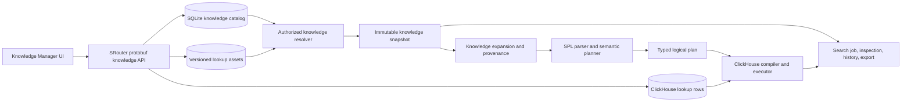

# Open Splunk Knowledge Objects Plan

**Status:** Proposed implementation plan
**Date:** August 6, 2026
**Compatibility target:** A bounded, documented subset of Splunk search-time
knowledge behavior for the single-node Open Splunk product

## Executive summary

Open Splunk already persists saved searches and app workspaces, compiles a
typed SPL subset into ClickHouse, and pins index, event-time, index-time, and
visibility boundaries into immutable search jobs. Supporting knowledge objects
well requires extending that same model with a versioned search-time knowledge
layer.

A knowledge object is not merely a named database record. It can change which
fields exist, how events are classified, how searches are parsed, and which
external values are joined into a result. Every admitted search must therefore:

1. resolve the knowledge objects visible to the authenticated principal and
   current app;
2. select the objects applicable to the authorized index scope and event
   metadata;
3. validate their dependencies and deterministic execution order;
4. pin exact object and asset versions into an immutable knowledge snapshot;
5. compile that snapshot into a bounded, source-attributed logical-plan prelude;
6. execute the user's SPL against the enriched relation; and
7. retain enough provenance for inspection, history, export, audit, and error
   reporting.

The first release should implement search-time field extractions, field
aliases, and calculated fields. The second should add bounded CSV lookups and
automatic lookup definitions. Event types, tags, and macros should follow once
the resolution and dependency model is proven. Data models, acceleration,
`tstats`, scripted lookups, and arbitrary custom search commands are separate
projects and are not part of this plan's first usable release.

At the repository's current correctness and testing standard, a useful
knowledge-object release is expected to require approximately **19–32
engineer-weeks**. Two experienced engineers could plausibly deliver it in
roughly **three to five calendar months**, depending on parallelism and the
amount of Splunk differential testing available. Data models and acceleration
would add a separate multi-month program.

## Relationship to the product plan

The main [product and architecture plan](product-architecture-plan.md) defines
an app as a workspace containing saved searches, reports, dashboards, field
aliases, and later knowledge objects. This document makes that later scope
concrete.

This plan preserves the existing architectural decisions:

- SQLite is the single-node control plane and remains the authority for object
  identity, ownership, definitions, publication state, and catalog revisions.
- Checked-in SQL migrations remain the only production schema authority;
  GORM models are explicit projections and `AutoMigrate` is not used.
- ClickHouse remains the event and analytical execution engine. GORM is never
  placed on the ClickHouse path.
- Browser APIs use SRouter routes with protobuf request and response messages.
- Search progress remains binary protobuf over the existing WebSocket.
- The parser, semantic planner, logical plan, and ClickHouse compiler remain
  distinct packages.
- Searches and exports never accept user-authored ClickHouse SQL.
- Unsupported knowledge syntax or behavior fails explicitly rather than being
  approximated silently.

## Goals

The knowledge-object system should:

- let applications define reusable search-time fields and classifications;
- scope objects predictably to a private owner, app, or tenant-wide global
  context;
- preserve deterministic precedence when names collide;
- apply objects only to matching events and authorized indexes;
- expose exact object versions and provenance in search inspection;
- keep running jobs stable while objects are updated, disabled, or deleted;
- reuse the existing SPL parser, typed expressions, logical plan, ClickHouse
  compiler, job lifecycle, history, export, audit, and UI field surfaces;
- bound configuration resolution, dependency expansion, generated SQL, lookup
  work, memory, and response size;
- make invalid or cyclic definitions impossible to publish; and
- provide an original UI that is familiar to Splunk knowledge managers without
  copying proprietary layouts or assets.

## Non-goals for the first release

The following are explicitly outside the initial knowledge-object release:

- exact compatibility with every `props.conf`, `transforms.conf`,
  `eventtypes.conf`, `tags.conf`, or `macros.conf` option;
- importing an arbitrary Splunk app directory without validation;
- data models, pivots, acceleration, and `tstats`;
- transaction definitions;
- KV Store lookups;
- DNS, GeoIP, database, scripted, or other external lookups;
- `outputlookup` and other search-triggered object mutation;
- arbitrary Python, JavaScript, shell, or custom search-command execution;
- knowledge-bundle replication to distributed search peers;
- search-head clustering or multi-writer control-plane replication; and
- retroactively changing completed or running search jobs when an object is
  edited.

## Current foundation

The repository already contains much of the necessary control and execution
plumbing.

### Reusable control-plane behavior

Saved searches already establish patterns for:

- stable random IDs;
- versioned protobuf definitions stored in SQLite;
- optimistic concurrency control;
- app/name uniqueness;
- private, app, and global sharing metadata;
- bounded keyset pagination;
- owner-scoped reads;
- dependency triggers that protect app deletion; and
- mutation audit committed atomically with the object change.

App workspaces already have a tenant boundary, stable identity, lifecycle,
default indexes, and a catalog revision. The knowledge catalog should use the
same transaction, migration, cursor, validation, and audit patterns rather than
building a second control-plane style.

### Reusable search behavior

The logical plan already has operators that cover part of the first release:

- `Extract` for bounded regular-expression capture;
- `ExtractJSON` for bounded JSON-path extraction;
- `Extend` for typed calculated fields; and
- field dependency analysis used by execution, inspection, suggestions,
  history, and export.

Field aliases cannot reuse `Rename`: Splunk-style aliases preserve the original
field while exposing another name. A new copy/alias operator is required.

Lookups, event-type classification, tags, and macro expansion require new
planner or parser stages.

### Gaps in the current saved-object model

The present saved-search store treats the authenticated owner as the read
boundary even though definitions carry sharing metadata. Knowledge resolution
must generalize that behavior so a principal can see:

- private objects they own in the current app;
- app-shared objects in apps they may read; and
- global objects visible across apps.

Full role ACL enforcement can follow multi-user RBAC, but the schema must be
capable of representing it from the first migration. Treating sharing as
display-only metadata would create an unsafe migration later.

## Terminology

- **Knowledge object:** a versioned named definition that affects parsing,
  search-time enrichment, classification, presentation, or reusable search
  behavior.
- **Object type:** extraction, alias, calculated field, lookup asset, lookup
  definition, event type, tag, macro, or workflow action.
- **Selector:** a bounded predicate over trusted canonical metadata that limits
  the events to which an object applies.
- **Knowledge catalog:** the control-plane set of current published objects and
  their metadata.
- **Catalog revision:** a monotonic tenant-scoped or app-scoped revision changed
  atomically by every visible catalog mutation.
- **Knowledge snapshot:** the immutable set of exact object versions, lookup
  assets, resolution decisions, and dependency order pinned to one search job.
- **Definition version:** the optimistic version of one object. It increases on
  every successful update.
- **Publication:** the atomic transition that makes a validated definition and
  all required assets visible to new searches.
- **Provenance:** metadata identifying the object and version that generated a
  logical operator, field, predicate, warning, or error.

## Compatibility posture

Knowledge behavior must be specified as carefully as SPL behavior. A new
`docs/knowledge-compatibility-v0.1.md` executable contract should be written
before the first object is applied in production.

The contract must define:

- object naming and case sensitivity;
- selector matching and ordering;
- private, app, and global visibility;
- collision and override precedence;
- overwrite, missing, null, empty, and multivalue semantics;
- the search-time operation sequence;
- dependency rules between stages;
- regex and JSON-path dialects;
- calculated-field evaluation behavior;
- lookup key and output behavior;
- event-type priority and tag identity;
- macro argument, quoting, and source-location behavior;
- update, disable, deletion, history-rerun, and export semantics; and
- every intentional deviation from Splunk.

A live licensed Splunk instance should be used for differential cases when
available. Ambiguous behavior must remain unsupported until it has either an
oracle result or an explicit Open Splunk deviation.

## Initial object tiers

### Tier 1 — Search-time fields

The first usable tier contains:

1. bounded regular-expression field extractions;
2. bounded JSON-path field extractions;
3. field aliases that preserve the original field; and
4. calculated fields using the supported `eval` expression subset.

These objects deliver immediate value and exercise the hard architectural
parts—catalog resolution, selectors, dependencies, snapshots, provenance, and
plan injection—while reusing most of the existing compiler.

### Tier 2 — Lookups

The second tier contains:

1. immutable versioned CSV lookup assets;
2. lookup definitions mapping event inputs to lookup keys and lookup outputs to
   event fields;
3. a bounded explicit `lookup` SPL command; and
4. automatic lookup definitions selected by trusted event metadata.

The initial tier supports exact composite-key matches only. Wildcard, CIDR,
temporal, scripted, external, and mutable lookups remain deferred until their
semantics and cost are justified.

### Tier 3 — Classification and reuse

The third tier contains:

1. event types defined by bounded base-search predicates;
2. tags attached to exact field/value pairs or event types;
3. parameterized macros with bounded expansion and source mapping; and
4. workflow actions that open a safe internal search or allowlisted external
   URL from a result field.

### Deferred tier — Data models and acceleration

Data models depend on stable field knowledge, lookup semantics, reusable
dataset predicates, inheritance, permissions, and an acceleration lifecycle.
They also require new commands and execution paths such as `datamodel`, pivot,
and `tstats`.

They should receive a separate design covering:

- dataset graphs and inheritance;
- object dependency validation;
- acceleration eligibility and storage;
- rebuild and backfill lifecycle;
- consistency during model updates;
- retention and deletion interactions;
- planner selection between raw events and accelerated summaries; and
- compatibility and performance measurement against Splunk.

## Target architecture



The resolver is part of trusted search admission. The browser never submits a
resolved object list or object body as authority. It identifies the app and
authored SPL; the server derives the visible catalog and pins the snapshot.

## Common control-plane model

### Knowledge-object registry

A common registry should contain indexed identity and lifecycle fields while
the typed definition remains a bounded protobuf blob.

Conceptually:

```text
knowledge_objects
  knowledge_object_id       stable opaque ID
  tenant_id                 security boundary
  app_id                    defining app
  owner_id                  defining owner
  object_type               closed enum
  name                      indexed canonical display name
  version                   optimistic version >= 1
  sharing_scope             private | app | global
  state                     draft | active | disabled
  definition_proto          bounded typed protobuf envelope
  definition_digest         SHA-256 of canonical definition bytes
  created_at_unix_micro
  updated_at_unix_micro
  disabled_at_unix_micro    nullable
```

Uniqueness should be explicit and binary-collated. The exact key depends on the
final precedence contract, but object creation must never rely on SQLite's
default case folding.

### Typed definitions

The protobuf source should define a closed `KnowledgeObjectType` enum and a
`KnowledgeObjectDefinition` with a `oneof`, for example:

```text
KnowledgeObjectDefinition
  common metadata
  oneof body
    FieldExtractionDefinition
    FieldAliasDefinition
    CalculatedFieldDefinition
    LookupDefinition
    EventTypeDefinition
    TagDefinition
    MacroDefinition
    WorkflowActionDefinition
```

The server must reject unknown future `oneof` alternatives on mutation while
preserving unknown fields on read/update round trips where protobuf forward
compatibility requires it.

Definitions are normalized before storage. Indexed registry fields and the
encoded definition must agree exactly; decoding a disagreement is a corruption
error, not an opportunity to repair data during a request.

### Selectors

Tier 1 and automatic-lookup definitions need a selector over trusted canonical
event fields:

```text
index       optional exact or bounded wildcard set
host        optional exact or bounded wildcard set
source      optional exact or bounded wildcard set
sourcetype  optional exact or bounded wildcard set
```

Selectors are ANDed across dimensions and ORed within one dimension. Empty
dimensions mean unrestricted. Selector count, pattern length, wildcard work,
and normalized byte size are bounded.

Cross-index searches can contain events matching different selectors. The
resolver therefore uses the authorized index scope to eliminate impossible
objects, but the logical plan still applies the selector per row. Catalog
resolution must not assume that one object either applies to the entire job or
does not apply at all.

### Dependencies

A normalized dependency table should record object-to-object and
object-to-asset edges:

```text
knowledge_object_dependencies
  tenant_id
  source_object_id
  source_object_version
  target_kind
  target_id
  target_version
  dependency_role
```

Publication validates that:

- every target exists and is readable from the source object's scope;
- no dependency points from an earlier search-time stage to a later stage;
- the graph is acyclic;
- graph depth and total nodes remain bounded;
- required assets are fully published; and
- deleting or disabling a target produces a deterministic dependent-object
  policy.

The initial deletion policy should reject deletion while an active object
depends on the target. Disabling a target should also fail unless dependents are
disabled atomically or the administrator explicitly selects a bounded cascade.

### Catalog revisions

Every create, update, scope change, state change, or deletion must advance a
monotonic tenant knowledge-catalog revision in the same SQLite transaction as
the mutation and audit record.

An optional app-level revision can reduce cache invalidation, but it must not
replace the tenant revision needed for global objects. Resolver caches use the
revision only as an invalidation key; they still validate decoded definitions
and authorization.

## Visibility and precedence

### Visibility

For a search in app `A` by principal `P`, the resolver considers:

1. private objects owned by `P` and defined in `A`;
2. app-shared objects defined in `A` that `P` may read; and
3. globally shared objects from apps whose exported knowledge `P` may read.

Disabled and draft objects are never executable. Administrators may list them,
but search admission does not expose their existence through error detail to an
unauthorized principal.

### Precedence

Exact Splunk precedence is broad and configuration-layer dependent. The first
Open Splunk release should publish a simpler explicit contract rather than
claiming unverified equivalence.

The proposed precedence for identical `(object_type, name)` identities is:

1. current owner's private object in the current app;
2. current app's app-shared object; and
3. one tenant-global object.

Global publication should reject an active global name collision for the same
tenant and object type. Within one winning object, no definition fragments are
merged from lower-precedence objects.

This precedence remains a decision until differential tests and product needs
confirm it. Whatever contract is selected must be enforced by schema indexes,
mutation checks, resolver tests, and UI warnings.

### Role permissions

The initial single-user deployment can treat the authenticated local principal
as able to read its app and tenant-global objects. The schema should still
support object ACL rows keyed by role with read and write grants.

When multi-user RBAC arrives, authorization must separately cover:

- reading and executing an object;
- editing an owned private object;
- publishing to an app;
- publishing globally;
- changing ownership or sharing;
- uploading and downloading lookup assets; and
- using workflow actions.

Object visibility must never expand index authorization. A global lookup or
event type may enrich only rows already admitted by the principal's authorized
index scope.

## Search-time operation sequence

Open Splunk should initially follow this documented sequence:

1. role or policy field filtering, when that feature exists;
2. explicit regular-expression and JSON field extractions;
3. automatic structured key/value extraction, when supported;
4. field aliases;
5. calculated fields;
6. automatic lookups;
7. event types; and
8. tags.

The authored base-search filter runs against the enriched relation so searches
may reference fields, event types, and tags produced by knowledge objects.
Authored pipe commands follow the base filter.

Dependencies may reference outputs from an earlier stage but not a later one.
Calculated fields within the same selector/stage are evaluated in parallel
against the stage input rather than left-to-right. This differs from one
authored `eval` command, whose assignments retain their existing left-to-right
behavior.

Objects within a stage use a deterministic order defined by the compatibility
contract. Definition name and stable object ID should be the final tie breakers;
database row order must never influence results.

## Immutable knowledge snapshots

### Admission

Search admission resolves knowledge only after authenticating the caller,
authorizing the app and indexes, and resolving the search's effective index
scope. It pins:

- tenant, principal, and app identity;
- tenant and app catalog revisions;
- exact object IDs, versions, types, names, selectors, and digests;
- exact lookup asset IDs, versions, sizes, and digests;
- normalized dependency and stage order;
- compiler compatibility version; and
- a digest of the complete canonical snapshot.

The snapshot is detached from mutable GORM records before job admission.

### Job lifecycle

A running job never observes a later catalog mutation. Inspection exposes the
safe object inventory and provenance without exposing definitions the caller
is no longer allowed to read.

Exports re-execute using the original job's knowledge snapshot, event-time
range, index-time cutoff, and visibility cutoff. If a required lookup version
has expired or crossed an index-deletion boundary, export fails explicitly as
unavailable.

Saved searches store authored SPL and app/time intent, not a trusted knowledge
snapshot. Running a saved search resolves current knowledge.

History records the knowledge-snapshot digest and a bounded safe inventory of
object IDs/versions for diagnostics. `Run Again` resolves current knowledge and
creates a new snapshot; it never reuses the old compiled prelude or lookup
asset by client request.

### Retention and garbage collection

Old object definitions are retained long enough to support the maximum search
job and export retention window. Lookup versions use a longer grace period
because their physical rows and uploaded asset may be larger and cleanup may be
asynchronous.

Garbage collection must prove that a version is unpublished, older than the
retention fence, and not referenced by any live job/export lease before
removing it. Ambiguous cleanup failures retain data and retry; they never make a
still-runnable job silently use a newer version.

## Planner and compiler changes

### Knowledge prelude

The semantic planner should build a backend-neutral knowledge prelude before
the authored base filter. It should reuse existing operators where their
semantics match and add explicit operators where they do not.

Expected additions include:

```text
ConditionalExtract
ConditionalExtractJSON
CopyFieldAlias
ParallelExtend
Lookup
ClassifyEventType
ApplyTags
```

An alternative composite `ApplyKnowledge` operator would hide dependencies and
make optimization and inspection harder. Individual typed operators are
preferred.

### Provenance

Every generated operator and output field should carry a private origin:

```text
kind                 authored_spl | knowledge_object
object_id            present for knowledge
object_version       present for knowledge
object_type
object_name
definition_location  field or expression within the object
```

Provenance must survive safe rewrites, nested ClickHouse subqueries, inspection,
execution diagnostics, history re-execution, and export. It is not necessarily
returned in every result cell; field discovery can expose a bounded summary.

Errors should identify the responsible object without echoing sensitive lookup
content or unauthorized definitions. For example:

```text
calculated field "latency_class" in app "gradethis" references field
"region_name" produced by the later lookup stage
```

### Dependency and field analysis

Plan analysis must distinguish:

- fields required from stored events;
- fields generated by earlier knowledge stages;
- fields generated by authored SPL;
- fields used only by selectors; and
- lookup key and output fields.

The compiler may push an authored predicate below knowledge enrichment only if
the predicate has no transitive dependency on a knowledge-produced field and
the rewrite preserves missing/null behavior. Selector predicates may be pushed
to the earliest safe stage because they use trusted canonical metadata.

### Parser-level macro expansion

Macros are not ordinary logical-plan enrichment. They affect SPL syntax before
normal parsing.

The macro expander must:

- resolve visible macros from the pinned snapshot;
- enforce maximum recursion depth, total expansions, argument count, source
  bytes, and resulting token count;
- detect direct and indirect recursion;
- bind arguments without blind shell- or SQL-style interpolation;
- preserve quoted-string and regex boundaries;
- produce a source map from expanded syntax to the authored query and macro
  definition; and
- report both the authored call site and responsible macro/version on failure.

If faithful safe parameter binding cannot be specified, the first macro release
should allow only zero-argument literal pipeline fragments rather than unsafe
text substitution.

## Object-type behavior

### Field extractions

A field extraction definition contains:

- selector;
- input field, defaulting to `_raw`;
- extraction kind: bounded RE2 regex or bounded JSON path;
- named output fields;
- overwrite policy;
- enabled state and deterministic stage order; and
- optional description.

Creation compiles and validates regexes/paths using the same packages and
budgets as authored `rex` and `spath`. Runtime work counts against the query's
aggregate extraction budget. Invalid UTF-8, container, missing, null,
multivalue, no-match, and duplicate-output behavior must be specified.

The initial implementation does not support arbitrary transform references,
format strings, repeated captures beyond the current SPL contract, or
index-time extraction.

### Field aliases

A field alias definition contains selector, source field, destination field,
and overwrite behavior.

The source remains available after aliasing. The default non-overwrite mode
copies the source only when the source is present and the destination is
missing. Exact behavior for explicit null and empty multivalue values belongs
in the compatibility contract.

Aliases cannot use fields produced by calculated fields, lookups, event types,
or tags because those stages run later. Alias cycles and multiple competing
sources for one destination are rejected unless a deterministic compatibility
rule is explicitly adopted.

### Calculated fields

A calculated field contains selector, destination name, and one expression from
the supported typed `eval` subset.

Definitions are parsed and type-checked at publication. All calculated fields
selected for one stage observe the same alias-stage input; they do not chain
through each other's outputs. If ordered dependent calculations are needed,
the user should express them in authored `eval` or the product should later add
an explicitly ordered calculated-field group.

The aggregate number and complexity of calculated expressions count against
the same scalar-expression and generated-SQL ceilings as authored SPL.

### Lookup assets and definitions

The first lookup release supports bounded UTF-8 CSV assets with:

- a header row;
- unique non-empty column names;
- String or explicit-null cells;
- bounded rows, columns, cell bytes, row bytes, and total bytes;
- deterministic duplicate-key handling; and
- a SHA-256 content digest.

A lookup definition references one immutable asset version and declares:

- one or more event input fields;
- corresponding lookup key columns;
- output column to event-field mappings;
- overwrite behavior;
- selector for automatic use; and
- duplicate-match behavior.

The initial exact lookup implementation should normalize a composite key as a
length-prefixed canonical byte sequence and store both its SHA-256 hash and
exact bytes. Hash comparison alone is never authoritative.

One possible shared ClickHouse table is:

```text
open_splunk.knowledge_lookup_rows
  tenant_id
  lookup_object_id
  lookup_version
  key_hash              FixedString(32)
  key_bytes             String
  row_ordinal           UInt64
  output_names          Array(String)
  output_values         Array(Nullable(String))
```

with an ordering key beginning with tenant, object, version, hash, exact key,
and row ordinal. The exact schema must be benchmarked against ClickHouse joins
and dictionary-backed alternatives before it is frozen.

Publication is staged:

1. validate and digest the uploaded CSV privately;
2. reserve an object/version in SQLite without making it active;
3. insert normalized rows under that immutable version;
4. verify row count, digest, schema, and key statistics;
5. atomically activate the definition and advance the catalog revision; and
6. retain failed or abandoned staging versions for bounded cleanup.

The collector and ordinary ingestion service never write lookup rows.

### Explicit `lookup` command

The explicit command must resolve a visible lookup definition by object name
through the server snapshot; the client cannot provide a physical table name or
asset path.

The first syntax should support exact input/output field mapping only. It must
define missing keys, null keys, multivalue keys, duplicate matches, output
overwrite, case sensitivity, and result ordering. Runtime work receives its own
row, byte, match, and memory limits.

### Automatic lookups

Automatic lookups run after calculated fields and before event types. They may
reference stored, extracted, aliased, or calculated fields, but not event types
or tags.

They are applied in deterministic name/ID order within a selector. A lookup may
consume an earlier lookup's output only if the compatibility contract explicitly
permits chaining and the dependency graph records it. The initial release
should reject lookup-to-lookup dependencies to keep one parallel stage.

### Event types

An event type contains a name, bounded base-search predicate, priority, selector
or app scope, and optional description.

The predicate is parsed and validated at publication. It may reference fields
available after automatic lookups but cannot reference tags. Matching events
receive a multivalue `eventtype` field or the documented Open Splunk equivalent.

Priority and name/ID ordering must be deterministic. Applying event types must
remain bounded even when many definitions are visible; admission should reject
a snapshot whose total predicate work exceeds the job budget.

### Tags

A tag definition attaches one tag to an exact field/value identity or event
type. Tags run after every other initial enrichment stage and publish a
queryable multivalue tag representation.

Type identity matters: integer `500` and string `"500"` must not become equal
unless the compatibility contract explicitly requires string coercion. Tag
cardinality per event and total tag definitions per snapshot are bounded.

### Workflow actions

Workflow actions are presentation knowledge and do not modify the ClickHouse
plan. The first release may support:

- open a new internal search with safely encoded field/value parameters; or
- open an allowlisted HTTPS URL template.

Templates use typed placeholders, never arbitrary HTML or JavaScript. URL
schemes, hosts, length, control characters, credentials, and redirects require
strict validation. Executions produce audit events when they cross an external
boundary.

## Browser APIs and protobuf contracts

Suggested protobuf API families:

```text
POST /api/v1/knowledge/objects/create
POST /api/v1/knowledge/objects/get
POST /api/v1/knowledge/objects/list
POST /api/v1/knowledge/objects/update
POST /api/v1/knowledge/objects/set-state
POST /api/v1/knowledge/objects/delete
POST /api/v1/knowledge/objects/validate
POST /api/v1/knowledge/objects/dependencies
POST /api/v1/knowledge/objects/dependents
POST /api/v1/knowledge/objects/preview

POST /api/v1/knowledge/lookups/upload
POST /api/v1/knowledge/lookups/get
POST /api/v1/knowledge/lookups/preview
```

Since KO-0F, the first six object-management handlers and bounded protobuf
codecs exist behind a test-only route assembly with real Store/Writer/audit
integration. Production `NewHandler` intentionally registers none of those
paths, and bootstrap continues to advertise no knowledge capability. The
boundary authenticates before decoding and attempts exactly one synchronous
journal append for every authenticated definitive rejection. It exposes that
rejection only after the append succeeds, returns the fixed unavailable
response if the append cannot complete, and suppresses false rejection rows for
committed or indeterminate mutation outcomes; this is readiness work, not
public API availability.

The first bounded lookup upload can carry CSV bytes in protobuf if the product
limit stays small enough for safe browser and Go memory use. Larger assets
should use a two-step upload grant plus a raw streaming route, analogous to the
intentional raw-download exception used by exports.

Every mutation includes expected version, idempotency identity where needed,
and an exact field mask. Mutation responses return the committed object and new
catalog revision. List routes use signed, owner/tenant-scoped keyset cursors and
may filter by app, object type, state, scope, selector summary, or text.

`validate` performs syntax, schema, dependency, budget, and permission checks
without publishing. `preview` applies a draft definition to a bounded retained
search snapshot and returns before/after schema and sample rows; it never lets a
browser submit raw ClickHouse SQL or bypass index authorization.

System bootstrap advertises knowledge features only when their complete API and
runtime family is configured:

```text
SERVER_FEATURE_KNOWLEDGE_FIELD_OBJECTS
SERVER_FEATURE_KNOWLEDGE_LOOKUPS
SERVER_FEATURE_KNOWLEDGE_CLASSIFICATION
SERVER_FEATURE_KNOWLEDGE_MACROS
SERVER_FEATURE_KNOWLEDGE_WORKFLOW_ACTIONS
```

## Browser application

### Knowledge Manager

Add an app-aware Knowledge Manager with:

- type, app, owner, sharing, state, and text filters;
- stable pagination and sorting;
- create, edit, duplicate, enable/disable, and delete actions;
- definition validation with source-located errors;
- selector builder for index, host, source, and sourcetype;
- dependency and dependent-object views;
- permission and sharing controls;
- lookup upload and bounded data preview;
- “test against recent events” using an authorized search snapshot;
- version, update time, owner, and audit history; and
- explicit warnings when a change alters fields used by saved searches or
  other knowledge objects.

### Search workspace integration

Field discovery should expose a bounded provenance summary:

```text
stored | extracted | alias | calculated | lookup | eventtype | tag | authored
```

Selecting a knowledge-derived field can show its active object name, version,
app, and safe description, with a link to the Knowledge Manager when the user
may read that definition.

Search inspection should show:

- knowledge snapshot digest and catalog revision;
- active object count by type;
- exact object IDs and versions the caller may inspect;
- generated logical stages;
- fields produced and consumed by each stage;
- lookup row/byte estimates and actual work; and
- warnings for shadowed objects or expensive global definitions.

## Security and governance

- Object resolution is server-authoritative and occurs after authentication.
- Knowledge objects never expand authorized index scope.
- Mutation and execution permissions are separate.
- Private object existence is not disclosed through list, dependency, preview,
  or search errors to other owners.
- Definition and asset plaintext is not copied into general audit messages.
- Lookup upload rejects path traversal, archives, formulas with side effects,
  malformed encodings, excessive rows/columns, duplicate headers, and control
  characters according to a written policy.
- CSV downloads use the same formula-injection protection as search exports.
- Regexes use the existing bounded RE2 path; no PCRE backtracking engine or
  executable replacement is introduced.
- Macros cannot inject ClickHouse SQL or access server environment variables.
- Workflow actions cannot execute scripts or `javascript:` URLs.
- Every create, update, sharing change, state change, delete, asset upload,
  external workflow action, and rejected privileged attempt produces a bounded
  audit event.
- Object content is subject to backup, restore, retention, and integrity
  verification with the rest of the control plane.
- Lookup rows and SQLite definitions must be bound to the same recovery set so
  restore cannot pair a catalog with the wrong asset generation.

## Resource limits

Exact defaults require benchmarks, but the first compatibility contract should
include hard ceilings for:

- active objects per tenant, app, owner, type, and search snapshot;
- definition and description bytes;
- selector dimensions, patterns, bytes, and wildcard work;
- dependency nodes, edges, and depth;
- generated knowledge operators and output fields;
- total regex programs, work units, and capture bytes;
- calculated expressions, predicates, nesting, and generated SQL;
- lookup asset bytes, rows, columns, cell bytes, and key width;
- lookup matches, output bytes, and memory per query;
- event-type predicates and classifications per event;
- tags per event and snapshot;
- macro recursion, arguments, expansions, tokens, and output bytes;
- preview rows, bytes, duration, and concurrency; and
- resolver time, cache entries, and decoded-definition memory.

Knowledge-generated work and authored SPL work must share aggregate query
ceilings. Separate per-object limits are insufficient because many individually
valid global objects could otherwise exceed the search budget together.

## Audit model

Knowledge mutation audit should be atomically committed with SQLite publication
and use a closed taxonomy such as:

```text
knowledge.object.create
knowledge.object.update
knowledge.object.scope_change
knowledge.object.enable
knowledge.object.disable
knowledge.object.delete
knowledge.lookup.upload
knowledge.lookup.publish
knowledge.lookup.cleanup
knowledge.preview.run
knowledge.workflow.external_open
```

Records contain actor, tenant, app, object ID, object type, object version,
sharing scope, occurrence time, result, and safe reason category. They do not
copy regex text, SPL, lookup rows, macro bodies, or workflow URL parameters.

Search-attempt audit should record the knowledge snapshot digest and object
count, not definition bodies. User-facing history may show a safe inventory of
object names and versions only while the caller remains authorized to inspect
them.

## Testing strategy

### Persistence and migration

- migration up/down and exact schema tests;
- STRICT-table, collation, uniqueness, trigger, and foreign-key tests;
- optimistic update and idempotency races;
- catalog revision atomicity;
- mutation plus audit atomicity;
- corruption and unknown-protobuf-field behavior;
- app archive/delete dependency behavior;
- backup/restore consistency between definitions and lookup rows; and
- version garbage collection with live job/export leases.

### Resolution and authorization

- private/app/global visibility matrix;
- role read/write/publish matrix when RBAC is available;
- collision and precedence corpus;
- active/draft/disabled behavior;
- selector exact, wildcard, null, and cross-index behavior;
- no object-existence disclosure across tenants, owners, or roles;
- global objects never widening index authorization;
- catalog mutation races during admission; and
- deterministic resolution independent of database row order.

### Dependency and ordering

- valid earlier-to-later dependencies;
- invalid later-to-earlier dependencies;
- direct and indirect cycles;
- missing and disabled targets;
- stage-parallel calculated fields;
- deterministic same-stage ordering;
- bounded graph depth and breadth; and
- dependent-object deletion and cascade behavior.

### Parser, planner, and compiler

- object-definition diagnostic goldens;
- knowledge-prelude logical-plan snapshots;
- provenance preservation through rewrites;
- field dependency analysis;
- predicate pushdown safety;
- parameterized ClickHouse SQL snapshots;
- generated SQL and relational-depth limits;
- macro source mapping, recursion, quoting, and token budgets; and
- unsupported constructs failing before partial execution.

### ClickHouse integration

- every field-object type against typed event fixtures;
- exact alias preservation and overwrite cases;
- calculated-field null, numeric, String, Bytes, and multivalue behavior;
- lookup composite keys, collisions, duplicates, missing keys, and output
  overwrite;
- old lookup version remaining executable after publication of a new version;
- automatic lookup ordering;
- event-type and tag classification;
- query cancellation and memory/time/scan limits; and
- one-scan or bounded-scan plan evidence for representative searches.

### Search lifecycle

- mutation during parsing, planning, running, inspection, and export;
- running jobs retaining their original snapshot;
- saved searches resolving current knowledge;
- history reruns resolving current knowledge;
- export reusing the original knowledge snapshot;
- expired asset failures being explicit;
- WebSocket preview and progress remaining bounded; and
- index deletion invalidating knowledge-backed re-execution consistently.

### Browser

- CRUD, optimistic conflicts, pagination, filtering, and permissions;
- source-located validation errors;
- lookup upload cancellation and retry;
- dependency graph accessibility;
- preview before/after rendering;
- field provenance and deep links;
- keyboard navigation and screen-reader labels; and
- malicious object names, descriptions, lookup cells, and workflow templates
  rendering only as escaped text.

### Differential compatibility

Where a licensed Splunk instance is available, compare:

- extraction no-match, null, overwrite, and multivalue behavior;
- alias overwrite and precedence;
- calculated-field parallel evaluation;
- automatic lookup ordering and duplicate matches;
- event-type priority;
- tag type/coercion behavior;
- macro quoting and source expansion; and
- app/private/global collision precedence.

Every intentional deviation should be recorded in the compatibility contract
with an executable Open Splunk fixture.

## Delivery plan

### Phase KO-0 — Contracts and catalog foundation

**Estimated effort:** 3–5 engineer-weeks
**Outcome:** knowledge definitions can be persisted, authorized, resolved, and
pinned without affecting search results.

**Implementation checkpoint (August 8, 2026):** contracts, migrations 0024
through 0031, canonical definition handling, the bounded authorization-first
reader, the atomic catalog Writer, the six administrator-only management
handlers/codecs with their synchronous rejected-attempt boundary, the
one-read-transaction active resolver, and opaque immutable snapshot preparation
are complete.
Their registrations remain intentionally absent from the production router and
exact API inventory, so their paths still return 404 and the capability is not
advertised. The Writer currently
publishes draft creates, draft/disabled definition updates (opaque future
bodies: metadata-only), draft/active disable transitions, and
draft/active/disabled delete tombstones with exact idempotency replay,
revision/state-token rotation, successful audit, immutable commit authority,
bounded health/reclamation, and crash recovery. `Create` with ACTIVE, `Update`
of an ACTIVE object, and `SetState` to ACTIVE deliberately return
`ErrActivePublicationUnavailable` until KO-1 supplies the publication compiler
and dependency derivation; an exact retained ACTIVE receipt from a newer binary
remains replayable through the concrete Writer only when its outcome is still
recognized and canonical, without becoming a false rejected attempt after
downgrade. The resolver now authorizes and validates every visible ACTIVE
candidate inside one SQLite read transaction, prunes against trusted effective
indexes, applies private/app/global precedence, proves exact winning dependency
closure, and returns a detached opaque authority. Snapshot preparation derives
canonical object, shadow, dependency, and static-charge authorities and pins a
shared Go/TypeScript B0/B1 wire/digest contract, but finalization remains sealed
until KO-0H supplies trusted compiler evidence. Remaining KO-0 work is
search-lifecycle attachment and the hidden Knowledge Manager list/detail shell.
Existing negative production registration/capability contracts remain hard
gates while that work proceeds. The capability remains disabled and
unadvertised.

- write `knowledge-compatibility-v0.1.md` for Tier 1;
- define protobuf object, selector, CRUD, validation, dependency, snapshot, and
  provenance contracts;
- add SQLite registry, dependency, ACL-ready, audit, and catalog-revision
  migrations;
- implement typed normalization, optimistic CRUD, pagination, and corruption
  checks;
- implement private/app/global resolution and explicit precedence;
- implement immutable snapshot creation and digesting;
- attach snapshot metadata to search jobs, inspection, history, and export;
- preserve negative feature-advertisement, API-registration, and capability
  contract tests; and
- add the initial Knowledge Manager list/detail shell.

### Phase KO-1 — Field knowledge

**Estimated effort:** 3–5 engineer-weeks
**Outcome:** reusable extractions, aliases, and calculated fields affect search
results predictably.

- add field extraction, alias, and calculated-field protobuf definitions;
- compile definitions at publication;
- add conditional extraction, alias-copy, and parallel-extend logical
  operators;
- add selectors and per-row application;
- inject the knowledge prelude before authored base search;
- add operator and field provenance;
- integrate field discovery, suggestions, inspection, history, and export;
- add create/edit/validate/preview UI; and
- add ClickHouse, lifecycle, browser, fuzz, and differential tests; then only
  after the complete hidden acceptance vertical passes, register the management
  APIs and advertise the capability.

### Phase KO-2 — Exact CSV lookups

**Estimated effort:** 5–8 engineer-weeks
**Outcome:** users can upload a bounded lookup and enrich events explicitly or
automatically by exact key.

- write lookup compatibility and resource-limit contracts;
- add immutable asset upload, digest, staging, publication, and cleanup;
- add ClickHouse lookup schema and migrations;
- benchmark normalized-table, join, and dictionary alternatives;
- implement exact composite-key lookup planning and execution;
- implement bounded `lookup` SPL syntax;
- implement automatic lookup selection and ordering;
- preserve lookup versions through job and export retention;
- add lookup management and preview UI; and
- add recovery, load, collision, cancellation, and adversarial tests.

### Phase KO-3 — Event types, tags, macros, and workflow actions

**Estimated effort:** 4–7 engineer-weeks
**Outcome:** teams can classify events, search by shared vocabulary, reuse safe
query fragments, and attach bounded result actions.

- specify and implement event-type predicates and priority;
- specify and implement tags;
- implement macro resolution, bounded expansion, and source mapping;
- implement safe internal-search and allowlisted HTTPS workflow actions;
- extend field/event detail UI and Knowledge Manager;
- add dependency, precedence, security, and differential tests; and
- extend audit taxonomy and search inspection.

### Phase KO-4 — Product hardening and portability

**Estimated effort:** 4–7 engineer-weeks
**Outcome:** knowledge objects are supportable as a durable multi-app product
surface.

- add versioned import/export of a validated Open Splunk knowledge bundle;
- add object impact and dependent-saved-search analysis;
- add role ACL enforcement when multi-user RBAC is available;
- add capacity metrics and administrator health signals;
- tune caches, query plans, and lookup storage against production fixtures;
- complete backup/restore and disaster-recovery exercises;
- add upgrade tests across every knowledge migration; and
- document onboarding, troubleshooting, limits, and compatibility deviations.

### Separate program — Data models and acceleration

**Estimated effort:** at least 12–24 additional engineer-weeks after KO-4
**Outcome:** to be defined in a dedicated plan after production knowledge usage
and query patterns are measured.

## First usable-release acceptance criteria

The Tier 1 knowledge release is complete when all of the following are true:

- An administrator can create, validate, update, disable, list, and delete a
  field extraction, field alias, or calculated field through protobuf APIs and
  the browser UI.
- Definitions are scoped to an app and private/app/global visibility follows a
  documented deterministic precedence contract.
- Selectors can constrain an object by authorized index, host, source, and
  sourcetype without widening search authorization.
- Published definitions are parsed, compiled, dependency-checked, and
  resource-checked before becoming visible.
- Search admission pins exact object versions and a snapshot digest.
- A catalog mutation during a running search does not change that search's
  results, schema, inspection, or export.
- Saved-search execution and history reruns resolve current knowledge, while
  export reuses the original job's knowledge snapshot.
- Knowledge enrichment runs before the authored base-search filter.
- Field aliases preserve their source field and follow explicit overwrite
  semantics.
- Calculated fields in one stage evaluate in parallel and cannot depend on
  each other's outputs.
- Generated operators preserve object/version provenance through ClickHouse
  execution and inspection.
- Field discovery identifies stored, extracted, aliased, calculated, and
  authored fields without exposing unauthorized definitions.
- Knowledge work counts against aggregate query complexity, regex, SQL, time,
  memory, scan, and result limits.
- Unsupported definitions produce source-attributed errors and never execute a
  supported prefix.
- Mutations and privileged failures produce bounded audit events without
  copying definition bodies.
- Backup and restore preserve the exact catalog revision and object bytes.
- One backend vertical test creates an extraction, ingests a matching event,
  searches by the extracted field, updates the extraction during a retained
  job, and proves original-job/export stability plus fresh-rerun behavior.

The lookup release adds these criteria:

- A bounded CSV lookup can be uploaded, validated, versioned, and published
  without partial visibility.
- Exact composite keys remain collision-safe through authoritative key-byte
  comparison.
- An explicit `lookup` command and an automatic lookup produce documented
  typed results under missing, null, duplicate, and overwrite cases.
- Updating a lookup does not change a running job or retained export.
- Lookup staging, publication, cleanup, backup, and restore are crash-tested.
- Lookup limits fail atomically and never silently truncate rows or matches.

## Principal risks and mitigations

| Risk | Why it matters | Mitigation |
| --- | --- | --- |
| Implicit global work slows every search | A few expensive objects can damage the product for all users | Selectors, aggregate budgets, publication cost estimates, inspection, and admin health metrics |
| Precedence differs from Splunk | The same app can produce surprising fields | Written compatibility contract, differential corpus, explicit Open Splunk deviations |
| Object updates make results irreproducible | History and exports lose trust | Immutable knowledge snapshots and retained object/asset versions |
| Dependency cycles or stage inversion | Definitions can never execute correctly | Normalized dependency graph, stage validation, bounded cycle detection at publication |
| Alias semantics are implemented as rename | Original fields disappear incorrectly | Dedicated copy/alias operator and differential tests |
| Lookups create an unbounded join path | Memory and latency become unpredictable | Exact-key first release, bounded assets, physical benchmarks, per-query limits |
| Lookup/control restore generations diverge | Definitions point to missing or wrong data | Recovery-set binding and digest verification across SQLite and ClickHouse |
| Macros become injection primitives | Parser, SQL, or UI boundaries can be bypassed | Bounded structured expansion, source maps, no SQL/environment access, defer unsafe forms |
| Sharing metadata is mistaken for authorization | Private definitions or data leak | Server-authoritative resolver, ACL-ready schema, non-disclosure tests |
| Data models are started too early | The foundation gets distorted around acceleration needs | Deliver and measure field knowledge and lookups before a separate data-model design |

## Decisions proposed by this plan

- Knowledge objects use a common identity/lifecycle registry with typed
  protobuf definitions.
- SQLite owns publication and catalog revisions; ClickHouse owns lookup
  execution rows.
- Search admission pins immutable knowledge snapshots.
- Exports reuse the original snapshot; saved searches and history reruns resolve
  current knowledge.
- Knowledge enrichment runs before authored base search.
- Field aliases use copy semantics, not `rename`.
- Calculated fields in the same stage evaluate in parallel.
- The initial lookup surface is immutable UTF-8 CSV with exact composite keys.
- `outputlookup`, scripts, external lookups, KV Store, and arbitrary app import
  are deferred.
- Data models and acceleration require a later dedicated plan.

## Decisions still required

1. Must Tier 1 exactly reproduce Splunk's full app/user/config precedence, or is
   the proposed simpler private → app → global precedence acceptable?
2. Should selectors support `index` in addition to Splunk's common
   host/source/sourcetype scopes?
3. What are the first production limits for objects per app, lookup rows,
   lookup bytes, and total knowledge work per query?
4. Should field extractions support only `_raw` initially, or any exact scalar
   String/Bytes field already available at that stage?
5. Should calculated fields use only the current SPL `eval` subset, or should
   arithmetic and additional functions be prerequisites?
6. Are automatic lookup-to-lookup dependencies required in the first lookup
   release?
7. Should CSV lookup matching be case-sensitive by default, and is a bounded
   case-insensitive option required immediately?
8. Should macros be included before event types and tags, or deferred until
   broader SPL syntax is available?
9. Is multi-user RBAC required before app/global publication is exposed, or may
   the initial local administrator manage those scopes in single-user mode?
10. What maximum job/export retention window must old definition and lookup
    versions support?

## Source notes

This plan is informed by:

- the current Open Splunk product and architecture plan;
- the executable Open Splunk SPL compatibility contract;
- the current saved-search, app-workspace, audit, search-job, history, export,
  planner, ClickHouse compiler, and field-discovery implementations; and
- Splunk's public documentation for knowledge management, search-time operation
  order, app ownership and sharing, field aliases, calculated fields, lookups,
  event types, tags, data models, permissions, and knowledge-bundle replication.

Relevant public references:

- [What is Splunk knowledge?](https://help.splunk.com/en/splunk-enterprise/manage-knowledge-objects/knowledge-management-manual/10.4/welcome-to-knowledge-management)
- [The sequence of search-time operations](https://help.splunk.com/?resourceId=SplunkCloud_Knowledge_Searchtimeoperationssequence)
- [App architecture and object ownership](https://help.splunk.com/en/splunk-enterprise/administer/admin-manual/10.2/meet-splunk-apps/app-architecture-and-object-ownership)
- [Manage knowledge object permissions](https://help.splunk.com/en/splunk-enterprise/manage-knowledge-objects/knowledge-management-manual/10.0/get-started-with-knowledge-objects/manage-knowledge-object-permissions)
- [About lookups](https://help.splunk.com/en/splunk-enterprise/manage-knowledge-objects/knowledge-management-manual/10.0/use-lookups-in-splunk-web/about-lookups)
- [About data models](https://help.splunk.com/en/splunk-enterprise/manage-knowledge-objects/knowledge-management-manual/10.2/build-a-data-model/about-data-models)
- [Knowledge bundle replication overview](https://help.splunk.com/splunk-enterprise/administer/distributed-search/10.2/knowledge-bundle-replication/knowledge-bundle-replication-overview)
