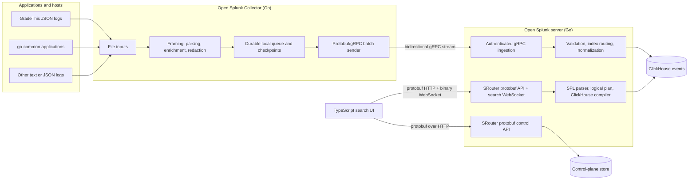

# Open Splunk: Product and Architecture Plan

**Status:** Initial planning draft  
**Date:** July 21, 2026  
**Working title:** “Open Splunk” is used in this document as a project name, not as a claim of affiliation or compatibility certification.

## Executive summary

Open Splunk will be a self-hosted log investigation and analytics product built around the parts of Splunk that make it unusually effective: a dense search workspace, event-first exploration, a pipe-oriented query language, fast statistical transformations, multiple logical indexes, and a lightweight collector that can be placed beside an application.

The first release is not intended to reproduce every Splunk subsystem. It should instead be a coherent vertical product that can:

1. collect structured and unstructured application logs reliably;
2. route those logs into one or more logical indexes;
3. preserve the familiar Splunk event model (`_time`, `_raw`, `index`, `host`, `source`, and `sourcetype`);
4. execute a carefully defined, useful subset of SPL against ClickHouse;
5. present the results in a search experience that feels immediately familiar to a Splunk user; and
6. fail explicitly when a command or semantic edge case is not yet supported.

The implementation will use:

- **Go** for the collector, ingestion service, SPL parser/compiler, query execution, search jobs, and administrative APIs;
- **TypeScript, React, and Next.js static export**, embedded into the Go server binary at build time, for the browser application;
- **ClickHouse** for canonical event storage and analytical query execution; and
- **SQLite** for the single-node control plane: index definitions, ingestion tokens, saved searches, dashboards, settings, and other mutable metadata.

OpenTelemetry will not be used for log collection in the target architecture. The current GradeThis OpenTelemetry pipeline is a useful source of lessons and migration data, but it will be replaced by the first-party **Open Splunk Collector** and first-party ingestion API.

Browser-to-server APIs will follow the established GradeThis pattern: SRouter routes with protobuf request and response codecs, generated Go messages on the server, and generated TypeScript messages in the client. Collector-to-server ingestion will use a separate protobuf-defined gRPC service.

## Product intent

The product promise should be narrow enough to be credible and broad enough to be genuinely useful:

> Search and analyze application logs with the SPL workflow people already know, while ClickHouse performs the storage, filtering, aggregation, and time-series work.

The first product should optimize for operational investigation:

- find a request by trace ID;
- inspect errors for one service or environment;
- pivot from an event field into a narrower search;
- aggregate error counts by route, host, or exception;
- graph latency and error volume over time;
- extract a field from JSON or text and immediately group by it;
- save a useful search and return to it; and
- keep data from several applications isolated in predictable indexes.

This implies a stronger bar than “an SPL-to-SQL demo.” The collector, index routing, time semantics, field discovery, event rendering, job cancellation, resource limits, and error messages are all part of the product.

## Scope and compatibility posture

### What “Splunk-like” means

Open Splunk should reproduce the interaction model and information density that make Splunk Search & Reporting effective:

- an app/index context;
- a prominent SPL search bar and time-range picker;
- a search job with progress, cancellation, duration, and result counts;
- a left rail for selected and interesting fields;
- a timeline histogram;
- Events, Statistics, and Visualization views;
- expandable raw events with field-value inspection;
- quick pivots such as “add to search” and “exclude from search”; and
- familiar concepts such as saved searches, reports, dashboards, and alerts.

The visual language should be original. We should not copy proprietary assets, icons, source code, exact layouts, or branding. “Familiar to a Splunk user” is a sound design objective; “indistinguishable from Splunk” creates unnecessary legal, accessibility, and maintainability risk. The project name and public compatibility claims should receive a trademark and product-counsel review before a public launch.

### What SPL-compatible means

SPL compatibility must be a written contract, not an impression. Each supported command needs documented syntax, type behavior, null behavior, ordering assumptions, and examples. Unsupported syntax should produce a precise error with a location and suggested alternative.

For example:

```text
unsupported command "transaction" at pipeline stage 3 (line 1, column 47)
```

The implementation should never silently reinterpret an unsupported SPL construct as approximately equivalent SQL.

## What the neighboring repositories tell us

The current GradeThis and go-common code provides a concrete first integration target.

### Current GradeThis log path

GradeThis currently uses a structured Zap logger from `go-common/pkg/logger`. Its production-style JSON encoder emits a stable core that includes fields such as:

- `timestamp`
- `level`
- `logger`
- `caller`
- `message`
- `stacktrace`
- `layer`
- `trace_id`

Request logs add useful fields such as `method`, `path`, `status`, `duration`, `bytes`, `ip`, and `user_agent`. Service code adds many domain-specific IDs and operation fields. Frontend telemetry is collected through the existing Faro endpoint and is eventually represented in backend JSON logs with application, browser, page, session, and trace fields.

Today, the local Docker path is roughly:

```text
GradeThis Zap JSON file
  -> OpenTelemetry Collector filelog receiver
  -> OpenTelemetry transformation/resource mapping
  -> OpenTelemetry ClickHouse exporter
  -> logs.otel_logs
  -> a narrow parsed_logs materialized view
  -> Grafana dashboards
```

The target path will be:

```text
GradeThis Zap JSON file
  -> Open Splunk Collector
  -> Open Splunk gRPC ingestion service
  -> normalized event batch
  -> ClickHouse open_splunk.events
  -> SPL search service
  -> Open Splunk search UI
```

### Lessons to preserve

- The application already emits newline-delimited structured JSON; the first collector integration does not require application logging changes.
- Trace correlation is already a first-class convention and must remain easy to search.
- Logger names and `layer` values provide useful low-cardinality dimensions.
- HTTP request logs already contain the fields needed for useful latency, status, and route investigations.
- The existing logs demonstrate why dynamic fields matter: business services add fields that cannot all be anticipated in a central table schema.

### Problems to correct

- The current collector configuration hardcodes one service name and one destination table, which does not generalize to multiple applications and indexes.
- The OpenTelemetry schema stores dynamic log attributes as strings, which weakens original JSON type fidelity for SPL comparisons and statistics.
- The current `parsed_logs` materialized view promotes only a small fixed field set.
- The current ClickHouse and collector containers use floating `latest` tags. Open Splunk should pin tested versions and make schema migrations explicit.
- Actual log samples include security-sensitive field names such as `token`, alongside user identifiers and contact data. Collection must have a centrally testable redaction and retention policy before the product is used with production logs.
- File paths in the logger profile and Docker collector mount should be reconciled during migration; the collector must report clearly when a configured input is absent or unreadable.

## Target architecture



The collector must not receive ClickHouse credentials or insert directly into ClickHouse. A server-side ingestion boundary gives us one place for token validation, index authorization, schema normalization, size limits, acknowledgments, audit logging, and future compatibility endpoints.

### Suggested monorepo shape

```text
open-splunk/
  app/                        # Root Next.js App Router source
  cmd/
    open-splunk-server/       # Go API and search service
    open-splunk-collector/    # Go edge collector
    open-splunk-loggen/       # Load and correctness test generator
  proto/
    open_splunk/v1/           # Browser APIs, shared models, collector gRPC
  gen/
    go/                       # Generated Go protobuf and gRPC code
    ts/                       # Generated ts-proto messages
  internal/
    collector/                # Inputs, framing, checkpoints, WAL, outputs
    ingest/                   # Auth, validation, normalization, batching
    indexes/                  # Index catalog and routing policy
    spl/                      # Lexer, parser, AST, semantic analysis
    plan/                     # Typed logical operators and optimizer
    clickhouse/               # SQL compiler, executor, migrations
    searchjobs/               # Lifecycle, progress fanout, cancellation, limits
    auth/                     # Users, roles, sessions, ingestion tokens
    savedobjects/             # Searches, reports, dashboards, alerts
    control/                  # SQLite connection, migrations, transactions
    export/                   # CSV/JSONL export jobs and artifacts
  migrations/
    clickhouse/
    sqlite/
  configs/
    examples/
  docs/
  out/                        # Generated Next.js export embedded by webui.go
  public/                     # Static Next.js source assets
  deploy/
    docker-compose.yaml
  next.config.ts
  package.json
  webui.go                    # Root Go package with //go:embed all:out
```

Package boundaries can evolve, but the SPL parser, logical planner, and ClickHouse SQL emitter should remain distinct packages. That separation is the architectural hinge of the project.

## Open Splunk Collector

The collector is a first-party Go daemon whose job is to turn local log sources into acknowledged, index-routed event batches without becoming part of the application’s failure path.

### Initial input support

The first production slice should support file monitoring well:

- one or more include globs;
- explicit exclude globs;
- newline-delimited JSON and raw line modes;
- configurable multiline framing;
- `start_at: beginning|end` for first discovery;
- rotation by rename/recreate;
- copy-truncate handling;
- file identity based on platform identifiers plus a content fingerprint;
- per-input `index`, `source`, `sourcetype`, `host`, and constant fields; and
- timestamp extraction with a documented fallback to collection time.

Container stdout, journald, syslog, Windows Event Log, and Kubernetes inputs are valuable later, but should not dilute the reliability work required for file collection.

### Processing pipeline

Each input should pass through a small, ordered processor chain:

1. frame one event, including multiline assembly;
2. preserve the original bytes as `_raw` within configured size limits;
3. decode JSON when the sourcetype expects it;
4. extract canonical timestamp, severity, message, trace ID, and span ID fields;
5. attach collector, host, app, environment, source, sourcetype, and index metadata;
6. apply allow-list, deny-list, rename, and redaction rules;
7. assign a stable event ID; and
8. append the normalized envelope to the local durable queue.

JSON numbers, booleans, arrays, nulls, and nested objects should remain typed. Flattening rules must be deterministic and reversible enough that dotted SPL field access behaves predictably.

### Delivery semantics

The collector should provide **at-least-once delivery**:

- append framed events to a segmented disk-backed queue before transmission;
- batch by byte size, event count, and maximum delay;
- send protobuf batches over a long-lived gRPC stream with standard gRPC compression;
- retry transient failures with bounded exponential backoff and jitter;
- respect gRPC flow control plus explicit server throttle/retry responses;
- advance file checkpoints only after the corresponding batch is durably acknowledged;
- retain unacknowledged segments across restarts; and
- expose queue depth, oldest-event age, sent, retried, rejected, and dropped counts.

The server and ClickHouse writer should use stable batch and event IDs so identical retries can be deduplicated within a documented window. “Exactly once” should not be promised; predictable at-least-once behavior plus idempotent retry handling is the honest contract.

### Ingestion protocol

Splunk HEC—**HTTP Event Collector**—is Splunk's token-authenticated HTTP API for sending events. Its common event envelope contains fields such as `time`, `host`, `source`, `sourcetype`, `index`, `event`, and `fields`. Supporting it would let some existing Splunk-compatible producers send data to Open Splunk without using our collector.

HEC compatibility is not required for the initial release. The first-party collector and server will use a versioned, bidirectional gRPC stream that provides strong batch acknowledgments, connection-level flow control, explicit application backpressure, and typed nested fields. A later HTTP compatibility facade can expose HEC-shaped endpoints without constraining the native protocol.

The eventual design therefore has two surfaces:

- a native protobuf/gRPC service used by the first-party collector; and
- a compatibility facade shaped like Splunk HTTP Event Collector for existing tools that already emit `time`, `host`, `source`, `sourcetype`, `index`, `event`, and `fields`.

The compatibility endpoint broadens adoption without making the collector depend on OpenTelemetry, but it belongs after the native path is reliable.

The native contract should use a bidirectional stream so one connection carries registration, event batches, heartbeats, acknowledgments, permanent rejections, and server throttle instructions:

```proto
service CollectorIngestService {
  rpc Collect(stream CollectorRequest) returns (stream CollectorResponse);
}

message CollectorRequest {
  oneof payload {
    CollectorHello hello = 1;
    EventBatch batch = 2;
    CollectorHeartbeat heartbeat = 3;
  }
}

message CollectorResponse {
  oneof payload {
    CollectorReady ready = 1;
    BatchAck batch_ack = 2;
    BatchReject batch_reject = 3;
    Throttle throttle = 4;
  }
}
```

Every `EventBatch` carries a stable batch ID, collector identity, protocol version, and ordered events. The server sends `BatchAck` only after the promised ClickHouse durability point. Retryable failures leave the batch unacknowledged; permanent event validation failures return structured field-level details so the collector can move rejected events to a local dead-letter file instead of blocking its entire queue.

Arbitrary log values need a custom protobuf `oneof` rather than `google.protobuf.Struct`, because `Struct` represents every number as a double and cannot preserve all integer values exactly. The shared contract should model strings, signed and unsigned integers, doubles, booleans, nulls, bytes, lists, and nested objects explicitly.

Collector tokens travel in gRPC metadata and remain scoped to allowed indexes. TLS is the production default. Plaintext gRPC may be enabled only by an explicit local-development setting; mutual TLS can follow when deployments are no longer confined to a trusted network.

### Configuration sketch

```yaml
server:
  address: logs.example.internal:8443
  transport: grpc
  token_file: /etc/open-splunk/ingest-token
  tls:
    enabled: true
    ca_file: /etc/open-splunk/ca.pem
  compression: gzip

state:
  directory: /var/lib/open-splunk-collector
  max_queue_bytes: 10GiB

inputs:
  - id: gradethis-backend
    type: file
    include:
      - /var/log/gradethis/*.log
    exclude:
      - "*.gz"
    format: ndjson
    start_at: end
    index: gradethis
    source: gradethis-backend
    sourcetype: go:zap:json
    fields:
      service: gradethis
      environment: production

processors:
  - type: redact
    fields: [token, authorization, password, session_token]
    replacement: "[REDACTED]"
```

Environment substitution, secret-file loading, configuration validation, and a `collector validate` command should be available from the beginning. Tokens must never be printed by config dumps or diagnostics.

## Ingestion service

The Go gRPC ingestion service owns the trust boundary between collectors and storage.

Its responsibilities are:

- authenticate hashed ingestion tokens;
- authorize each token for specific indexes;
- reject unknown, disabled, or over-quota indexes;
- enforce request, batch, event, field-count, nesting, and field-name limits;
- validate timestamps and apply a policy for implausibly old or future events;
- normalize canonical metadata without discarding the original event;
- apply mandatory server-side redaction as defense in depth;
- batch ClickHouse inserts efficiently;
- acknowledge only the durability level promised by the protocol;
- publish collector heartbeats and lag information; and
- return machine-actionable partial rejection details.

The ingestion API should be independently scalable later, but the MVP can run it in the same server process as the search and administrative APIs.

The first deployment is single-user on a trusted network, so end-user authentication and RBAC are not release blockers. Collector ingestion tokens remain necessary: even on a trusted network, they prevent accidental cross-index writes and establish a protocol that can be hardened later. SQLite is sufficient for this single-node control plane and should run in WAL mode with explicit backup and migration tooling.

## Indexes, apps, and tenancy

Splunk “apps” and “indexes” should not be represented by the same database entity, even if the first UI creates one of each together.

- An **index** is a logical data boundary with retention, ingestion permissions, search permissions, and default field behavior.
- An **app** is a workspace containing navigation, default index scopes, saved searches, reports, dashboards, field aliases, and later other knowledge objects.

For the initial internal deployment, an app may map one-to-one to its primary index—for example, a `gradethis` app whose default search scope is `index=gradethis`. The data model should still allow one app to search several indexes and one index to be used by several apps.

Environment is not a special storage hierarchy. Each collector explicitly chooses its destination index, so an operator may send development and production logs to different indexes when different retention or isolation is useful. Otherwise, both can share an index and carry `env` or `environment` as an ordinary searchable event field. Open Splunk should support either policy without imposing one.

Indexes should be logical partitions in a shared event table rather than one ClickHouse database or table per app. This avoids schema drift, excessive parts, cross-index query complexity, and migration duplication. Every query must be intersected with the requesting user’s allowed index set, regardless of what the SPL text contains.

## ClickHouse event model

The storage model should preserve Splunk’s canonical event fields while retaining typed application data.

### Conceptual event

```text
event_id          stable identifier for retry handling
tenant_id         future-proof security boundary, even if initially single-tenant
index_name        logical index
_time             event time
_indextime        accepted/ingested time
host              originating host
source            originating file, stream, or producer
sourcetype        parser/semantic profile
service           promoted application/service name
level             promoted normalized severity
body              human-readable message when available
_raw              original event representation
trace_id           promoted correlation field
span_id            promoted correlation field
fields             typed dynamic JSON object
field_names        normalized paths used for field discovery
collector_id       collector identity
batch_id           delivery batch identity
```

The physical schema should use typed, promoted columns for fields that almost every search touches, plus a dynamic typed payload for the long tail. A starting point is a ClickHouse `JSON` column with static type hints for common paths and a bounded number of dynamic paths. We should benchmark that against separate typed maps before freezing the schema; observability data with extremely high field cardinality can make either design expensive when used carelessly.

The table should initially use `MergeTree`, time-based partitions, and an ordering key beginning with the security/index dimensions that nearly every search filters, followed by a coarse time bucket and event time. For example:

```text
ORDER BY (tenant_id, index_name, toStartOfHour(_time), _time, event_id)
```

This is a hypothesis, not a universal answer. It must be validated against the expected number of indexes, retention period, ingest rate, typical time range, and query corpus before production data is committed.

Additional storage principles:

- pin a tested ClickHouse release;
- use the current native text index for token searches over `_raw`/`body`, with a benchmarked tokenizer;
- retain the original event even when structured parsing succeeds;
- materialize frequently used fields only after query evidence justifies it;
- make retention configurable per index;
- avoid tiny inserts by batching in the server;
- place server-side memory, result-row, execution-time, and concurrency limits on every search; and
- expose generated SQL and ClickHouse `EXPLAIN` to administrators, not ordinary users by default.

## SPL engine

### Compiler pipeline

```text
SPL source
  -> lexer
  -> parser and source-located AST
  -> semantic analysis and schema/type resolution
  -> typed logical pipeline
  -> safe rewrites and filter pushdown
  -> ClickHouse relational plan
  -> parameterized ClickHouse SQL
  -> streamed result schema and rows
```

Directly concatenating SQL fragments while walking pipe commands will fail as soon as aliases, aggregations, window functions, or stage ordering become meaningful. The logical plan should contain backend-neutral operators such as:

```text
Scan, Filter, Project, Extend, Extract, Aggregate,
Window, Sort, Limit, Rename, TimeBucket, Output
```

Every operator should know its input and output schema. Stage boundaries can then lower to nested SQL subqueries only when ClickHouse alias visibility or aggregation semantics require them.

### SPL semantic choices that must be explicit

Some of the hardest compatibility work is not grammar; it is behavior:

- base `search` boolean precedence differs from `where`/`eval` precedence;
- free terms need a precise definition over `_raw` and token indexes;
- wildcards differ between term, field, and value positions;
- missing, null, empty, numeric, string, and multivalue fields behave differently;
- event order is undefined until a command establishes it;
- transforming commands remove event fields that are not grouped or aggregated;
- `stats`, `eventstats`, and `streamstats` have different result shapes;
- time zones and relative time modifiers affect both parsing and bucketing; and
- regex syntax and capture naming need a declared dialect.

These rules should live in a versioned **SPL compatibility specification** and executable conformance tests.

### Recommended first command set

The first useful compatibility tier should support:

**Search and projection**

- base search terms and field comparisons
- `search`
- `where`
- `fields`
- `table`
- `rename`

**Expressions and extraction**

- `eval`
- `rex`
- `spath`
- `bin`/`bucket`

**Aggregation and presentation**

- `stats`
- `chart`
- `timechart`
- `sort`
- `head`
- `tail`
- `dedup`
- `top`
- `rare`

**Initial aggregate functions**

- `count`, `dc`, `values`, `list`
- `sum`, `avg`, `min`, `max`
- `earliest`, `latest`
- `p50`, `p90`, `p95`, `p99`, and `perc<N>`

**Initial eval functions**

- `if`, `case`, `coalesce`, `isnull`, `isnotnull`
- `tonumber`, `tostring`, `round`, `ceil`, `floor`
- `lower`, `upper`, `len`, `substr`, concatenation
- `match`, `like`, `replace`
- `now`, `relative_time`, `strftime`, `strptime`

`eventstats` is a good second-tier command. `streamstats`, `transaction`, subsearches, `join`, `append`, `appendpipe`, `map`, `foreach`, data models, `tstats`, and arbitrary scripted commands should remain explicitly out of the first release.

### Example target searches

The first usable release should treat the following as its initial GradeThis compatibility corpus.

**Follow one request or background operation:**

```spl
index=gradethis trace_id="<trace-id>"
| sort _time
| table _time level layer logger message
```

**Inspect errors and warnings:**

```spl
index=gradethis (level=ERROR OR level=WARN)
| sort -_time
```

**Find a known error fragment in raw log text:**

```spl
index=gradethis "connection refused"
| table _time level logger message trace_id
```

**Count events by severity:**

```spl
index=gradethis
| stats count by level
| sort -count
```

**Find the most frequent errors:**

```spl
index=gradethis level=ERROR
| stats count by logger, message
| sort -count
| head 20
```

**Chart event volume by severity:**

```spl
index=gradethis
| timechart span=5m count by level
```

**Chart server errors by route:**

```spl
index=gradethis message="Request metrics" status>=500
| timechart span=5m count by path
```

**Count HTTP responses by route and status:**

```spl
index=gradethis message="Request metrics"
| stats count by path, status
| sort -count
```

**Find slow routes:**

```spl
index=gradethis message="Request metrics"
| eval duration_ms=tonumber(replace(duration, "ms$", ""))
| stats count p95(duration_ms) as p95_ms by path
| where p95_ms > 500
```

**Inspect the most common messages:**

```spl
index=gradethis
| top limit=20 message
```

## Browser API: SRouter and protobuf

Every browser-facing application endpoint will use SRouter with protobuf request and response messages, matching GradeThis:

- `.proto` files under the versioned `open_splunk.v1` package are the source of truth;
- `protoc` generates Go messages for the server and `ts-proto` TypeScript messages for the Next.js client;
- Go routes use `router.NewGenericRouteDefinition` and `codec.NewProtoCodec`;
- the frontend uses `@per/go-common-core`'s `ProtobufTransport` with generated encoders and decoders;
- successful payloads use `application/x-protobuf`; and
- generated files are reproducible in CI and are never edited by hand.

The initial search API should expose bounded request/response operations such as:

```text
POST /api/v1/search/jobs/create
POST /api/v1/search/jobs/get
POST /api/v1/search/jobs/results
POST /api/v1/search/jobs/field-summary
POST /api/v1/search/jobs/cancel
```

Index configuration, collector status, search history, and saved-object APIs follow the same SRouter/protobuf convention. The single-user release can register these routes without end-user authentication; this transport choice does not prevent adding SRouter authentication middleware later.

Search results are dynamic, so their protobuf model must carry both a schema and typed cells. A `ResultValue` `oneof` should preserve strings, integers, doubles, booleans, timestamps, nulls, bytes, lists, and objects. Result pages should include stable column definitions and bounded rows instead of embedding an untyped JSON document in protobuf.

Search progress will use a long-lived WebSocket registered as a raw SRouter route, following the `go-common/pkg/common_ws` pattern. Every application frame is binary protobuf; text frames are rejected or ignored. The HTTP routes remain authoritative for creating, canceling, inspecting, and paging a search, while the WebSocket carries timely progress and bounded previews.

```text
GET /api/v1/search/ws
```

The client sends a `SearchWebSocketCommand` with subscribe/unsubscribe payloads. A subscription identifies either a search job or an export job and includes the last sequence number the client has processed. The server sends sequenced `SearchWebSocketEvent` messages whose payload can be:

- subscription acknowledged;
- search state changed;
- progress updated, including scanned rows/bytes, matches, and elapsed time;
- result schema available;
- bounded preview rows available;
- export progress or completion;
- warning emitted;
- search completed, failed, or canceled; or
- resynchronization required.

Each search or export job retains a bounded replay buffer of recent progress events. After a reconnect, the client subscribes with `after_sequence`; the server replays what is still available. If the requested sequence has expired, it emits `resynchronization_required` and the client restores state through the corresponding SRouter `get` route. Full result sets and export artifacts never travel through the WebSocket.

The socket implementation must enforce binary-frame size limits, bounded per-connection send queues, ping/pong liveness, origin checks, and graceful shutdown. A slow browser may lose preview updates and resynchronize, but it must never block ClickHouse execution or the ingestion path.

## Search jobs and API behavior

Even a single-node product benefits from a search-job abstraction. A job should have a stable search ID, owner, normalized query, effective index scope, time range, state, progress metadata, result schema, ClickHouse query ID, warnings, timing, and expiration.

Each job also records a resolved absolute time range and `_indextime` cutoff. Re-running an operation such as export against that snapshot excludes events ingested after the original search began, making results repeatable within the job's retention window.

Recommended lifecycle:

```text
queued -> parsing -> planning -> running -> completed
                                   |-> failed
                                   |-> canceled
```

The API should support:

- creating a search with SPL and an explicit earliest/latest time range;
- publishing sequenced state, progress, warnings, schema, and bounded previews through the protobuf WebSocket;
- retrieving Events or Statistics through bounded protobuf result pages;
- canceling a job and propagating cancellation to ClickHouse;
- inspecting safe plan and timing details; and
- expiring transient results after a bounded interval.

The client creates a job through SRouter, subscribes to its progress over the WebSocket, and retrieves stable result pages through SRouter as they become available. The `get` route doubles as reconnect and diagnostic fallback, not as the normal progress mechanism. Raw-event searches must use bounded pagination and should not attempt to buffer millions of rows in the Go process or browser.

## Saved searches, search history, and results export

These are three related but distinct product concepts and should not share one overloaded record.

### Saved searches

A saved search is a reusable definition stored deliberately by the user. The first release should persist it in SQLite with:

- stable ID and optimistic version;
- name and optional description;
- owning app/workspace;
- original SPL source, never generated ClickHouse SQL;
- time-range specification, preserving relative values such as `-24h` and `now`;
- preferred result tab and selected fields;
- optional visualization settings;
- created and updated timestamps; and
- later-compatible ownership and sharing fields, even though the first deployment is single-user.

Loading a saved search restores the editor and time picker. Running it creates an ordinary search job, so it is parsed, compiled, resource-limited, and index-authorized again; saved searches are not trusted precompiled plans. The UI should support Save, Save As, Open, Rename, Duplicate, and Delete, with an unsaved-changes indicator.

Reports can later extend a saved search with richer table/visualization presentation. Scheduled searches and alerts can later reference the same saved-search ID. They should not be folded into the initial saved-search implementation.

SRouter/protobuf routes should include:

```text
POST /api/v1/saved-searches/create
POST /api/v1/saved-searches/get
POST /api/v1/saved-searches/list
POST /api/v1/saved-searches/update
POST /api/v1/saved-searches/delete
```

### Search history

Search history is created automatically for every attempted job, including parse failures, cancellations, and execution failures. It records metadata rather than copying result rows:

- search ID and original SPL;
- original time-range expression plus resolved earliest/latest values;
- app and effective index scope;
- start/end times and final state;
- matched rows, scanned rows/bytes, and duration when available;
- warnings or a safe failure summary;
- compiler compatibility version; and
- whether the search originated from a saved search.

History is bounded by configurable age and row-count limits in SQLite. The UI should expose Recent Searches and a full History view with Open in Search, Run Again, Save, and Delete actions. “Open” restores the original query and time-range expression; “Run Again” creates a fresh job and resolves relative time against the current clock. History never stores generated SQL as the reusable source of truth.

### Results export

Export is server-side so large results do not need to be assembled in browser memory. The first usable release should support:

- CSV for event and statistical tables;
- JSON Lines for typed events and rows;
- explicit column selection and ordering;
- configurable row and byte limits;
- cancellation and progress reporting;
- streaming to a temporary artifact rather than buffering in Go memory; and
- automatic artifact expiration and cleanup.

An export references a completed or still-retained search job and executes against the job's resolved time range and `_indextime` cutoff. It uses the same logical plan and resource limits, records its own status, and never accepts raw ClickHouse SQL. If the source job has expired, the user must rerun the search before exporting.

Export creation, inspection, and cancellation use SRouter/protobuf:

```text
POST /api/v1/search/exports/create
POST /api/v1/search/exports/get
POST /api/v1/search/exports/cancel
```

The completed protobuf response supplies a short-lived, single-purpose download token. Downloading the actual CSV or JSONL uses a raw SRouter download route with the correct `Content-Type` and `Content-Disposition`; file bytes are the intentional exception to protobuf response serialization. CSV output must use correct RFC-style quoting and formula-injection protection for cells beginning with spreadsheet control characters.

Export progress can use the existing protobuf WebSocket by subscribing to the export ID. Full export contents never travel through WebSocket frames.

## Browser application

The browser application will be a TypeScript React client built with Next.js static export. It will use generated `ts-proto` models and the same `@per/go-common-core` protobuf transport pattern as GradeThis. The static export will not be a companion runtime directory: it will be compiled into `open-splunk-server` so production requires neither Node.js nor loose frontend files.

### Single-binary packaging

The supported release build runs in this order:

1. install the pinned frontend dependencies from the lockfile;
2. generate TypeScript protobuf models into `gen/ts`;
3. clean `out/` and run the root Next.js application with `output: "export"`;
4. verify `out/index.html` and its referenced hashed assets exist;
5. generate an asset manifest containing the UI and source revision hashes; and
6. compile the root Go asset package with `//go:embed all:out`, embedding the static UI, manifest, and database migrations into the server.

`open-splunk-server` serves the embedded filesystem using `fs.Sub`, `http.FS`, and a dedicated static handler. Hashed `/_next/static` assets receive long immutable cache headers; HTML entry points do not. Static route handling must be tested for direct navigation and browser refreshes, and API/WebSocket paths must be registered ahead of the UI fallback so the embedded frontend can never shadow SRouter routes.

The supported build target must fail when the Next.js export or generated protobufs are absent. `out/` is treated as generated input to `go build`, not hand-maintained source, and release CI rebuilds it from a clean directory to prevent stale assets. A test launches the compiled binary from an otherwise empty temporary directory and verifies the UI, SRouter API, and WebSocket handshake without access to the repository.

This produces one deployable **Open Splunk server application binary** containing:

- the Next.js UI;
- Go HTTP/SRouter APIs;
- the protobuf progress WebSocket;
- the collector gRPC ingestion server;
- protobuf descriptors/build metadata; and
- SQLite and ClickHouse migrations.

Runtime configuration, SQLite data, export artifacts, and ClickHouse data remain external writable state. ClickHouse remains a separate database process, and `open-splunk-collector` remains a separate small binary because it runs on log-producing hosts. “Single binary” therefore describes the complete Open Splunk server application, not bundling ClickHouse or remote collectors into the same executable.

### Search workspace

The first high-fidelity screen should include:

1. **Top product bar** — current app, navigation, activity/jobs, settings, and user menu.
2. **Search row** — multiline SPL editor, syntax highlighting, completion, explicit time range, and Run/Cancel action.
3. **Job strip** — state, scanned events/bytes, matched events, elapsed time, warnings, and actions.
4. **Fields rail** — Selected Fields and Interesting Fields with counts and top values.
5. **Timeline** — event histogram with drag-to-narrow time range.
6. **Result tabs** — Events, Statistics, and Visualization.
7. **Events view** — `_time`, raw text, matched-term highlighting, expansion, and typed fields.
8. **Statistics view** — virtualized table with sorting and export.
9. **Visualization view** — automatic chart suggestions for `timechart`, `chart`, and suitable `stats` results.
10. **Search actions** — Save, Save As, Open, History, and Export.

The event detail interaction is especially important. Selecting a field value should offer Include, Exclude, and New Search actions that safely modify the AST or query text rather than relying on brittle string insertion.

### Editor support

The SPL editor should eventually share the Go grammar through generated syntax metadata or a small TypeScript grammar package. The first version needs:

- command and function highlighting;
- pipe-aware completion;
- field completion based on index and time scope;
- inline parse errors with source ranges;
- command documentation on hover; and
- formatting that does not rewrite quoted strings or regexes.

## Security and governance

Security is part of the data model, not a later middleware task.

- Store ingestion tokens only as hashes; show plaintext once at creation.
- Scope tokens to explicit indexes and optional source/host constraints.
- Intersect every search with RBAC-authorized indexes in the logical plan.
- Parameterize values and quote identifiers through a single ClickHouse compiler path.
- Never accept user-provided SQL as part of ordinary SPL.
- Apply query time, memory, row, byte, and concurrency budgets.
- Maintain audit events for authentication, token changes, index changes, searches, exports, and saved-object changes.
- Provide collector and server redaction, with tests for auth headers, cookies, tokens, passwords, and known application secrets.
- Make PII retention and export permissions explicit per index.
- Escape raw events in the UI; log content must never become executable HTML.
- Keep the collector’s own logs on a separate source or prevent self-collection loops.

## Testing strategy

### SPL correctness

- lexer and parser table tests;
- source-location and diagnostic golden tests;
- semantic/type-checker tests;
- AST-to-logical-plan snapshots;
- logical-plan-to-ClickHouse-SQL snapshots;
- ClickHouse integration tests with fixed event fixtures;
- a corpus of real GradeThis searches and edge cases;
- fuzzing for the lexer, parser, wildcard handling, regex handling, and identifier quoting; and
- differential tests against a licensed Splunk instance when one is available, with every intentional deviation recorded.

### Collector correctness

- append, restart, rename rotation, copy-truncate, deletion, and delayed file-creation tests;
- crash points before and after queue append, gRPC send, server insert, acknowledgment, and checkpoint;
- offline queue growth and recovery;
- corrupt queue segment behavior;
- partial batch rejection;
- gRPC reconnect, flow-control, throttle, and backpressure behavior;
- multiline and oversized-event cases;
- redaction invariants; and
- duplicate accounting under retries.

### Transport contracts

- protobuf generation is reproducible and leaves the worktree clean;
- protobuf breaking-change checks protect field numbers, reserved fields, and enum values;
- every SRouter route round-trips generated Go and TypeScript messages;
- dynamic result values preserve integer, floating-point, boolean, null, list, and object types;
- collector gRPC interoperability tests cover hello, batch acknowledgment, rejection, throttle, reconnect, and protocol-version mismatch;
- WebSocket tests cover binary-only framing, subscribe/unsubscribe, monotonic sequence numbers, replay, resynchronization, bounded queues, ping/pong, and shutdown; and
- unknown protobuf fields remain forward compatible across client/server upgrades.

### Embedded application artifact

- a clean release build regenerates protobufs and the Next.js export before `go build`;
- building fails when required UI assets or the asset manifest are missing;
- the compiled server starts from an empty working directory with no Node.js installation or frontend files;
- direct navigation and refresh work for every exported Next.js route;
- immutable caching applies only to content-hashed assets, not HTML entry points;
- embedded UI, Go server, protobuf schema, and migration versions report one consistent build revision; and
- Linux and macOS release binaries serve byte-identical frontend assets for the same source revision.

### End-to-end product tests

- collector fixture -> ingestion -> ClickHouse -> SPL -> browser result;
- browser command through SRouter protobuf -> WebSocket progress -> paged protobuf results;
- multi-index authorization and forbidden-index searches;
- query cancellation;
- saved-search persistence and search-history retention;
- CSV/JSONL export snapshot, quoting, size-limit, cancellation, and cleanup behavior;
- browser accessibility and keyboard navigation;
- large result virtualization; and
- time zone and daylight-saving boundaries.

### Performance harness

`open-splunk-loggen` should produce repeatable Zap-style, raw, nested JSON, and high-cardinality fixtures. Benchmarks should record ingest events/sec, compressed bytes/sec, queue lag, ClickHouse part count, storage ratio, rows/bytes scanned, cold and warm search latency, concurrent query degradation, and browser rendering cost.

The initial throughput target is a sustained maximum of **1,000 events per second** on one Open Splunk server and one ClickHouse server. At that sustained rate, the system receives 86.4 million events per day. At an average raw event size of 1 KiB, that is roughly 82 GiB/day or 2.4 TiB over 30 days before ClickHouse compression and index overhead. Retention, average event size, hardware, and simultaneous-search expectations must therefore be measured before setting storage-capacity and latency acceptance thresholds.

## Delivery plan

The phases below are ordered by dependency and risk, not by calendar estimate.

### Phase 0 — Contracts and skeleton

**Outcome:** the repo builds, local infrastructure starts, and the most consequential semantics are written down.

- establish the Go workspace and Next.js static-export TypeScript workspace;
- pin ClickHouse and supporting container versions;
- initialize the SQLite control plane, WAL settings, migrations, and backup contract;
- establish versioned `.proto` sources plus reproducible Go, gRPC, and `ts-proto` generation;
- establish the clean Next.js-export staging and `go:embed` build pipeline for the self-contained server binary;
- define the canonical event envelope and index model;
- define the collector bidirectional gRPC service, batch acknowledgment, rejection, throttle, and typed-value contracts;
- define the SRouter search/control APIs and protobuf WebSocket command/event contracts;
- write SPL compatibility tier 1;
- create migrations and local Docker Compose;
- add CI for Go, TypeScript, migrations, and integration tests; and
- add a small sanitized GradeThis log fixture corpus.

### Phase 1 — GradeThis vertical slice

**Outcome:** a developer can collect GradeThis logs and investigate them in a Splunk-like Events screen without OpenTelemetry.

- build the file input, JSON decoder, checkpoints, local queue, gRPC stream, and collector diagnostics;
- build gRPC ingestion token auth, index routing, validation, batching, acknowledgments, and ClickHouse insert;
- create the `gradethis` index and collector example config;
- remove the GradeThis OTel log collector from the target Compose path and add Open Splunk Collector;
- implement base search, field comparisons, boolean expressions, `fields`, `table`, `sort`, and `head`;
- implement SRouter protobuf search routes, the protobuf progress WebSocket, replay/resynchronization, and paged result messages;
- implement SQLite-backed saved-search CRUD and automatic bounded search history;
- build the search bar, time picker, job lifecycle, fields rail, timeline, and event renderer against those generated TypeScript contracts; and
- prove trace-ID, error, HTTP status, path, and duration investigations end to end.

### Phase 2 — Analytical SPL

**Outcome:** Open Splunk is useful for the common operational aggregations that justify ClickHouse.

- implement `eval`, `where`, `stats`, `chart`, `timechart`, `rename`, `dedup`, `top`, `rare`, `rex`, `spath`, and `bin`;
- add Statistics and Visualization result modes;
- add a typed result schema and chart contract;
- add server-side CSV/JSONL export jobs, WebSocket progress, expiring artifacts, and safe downloads;
- add field autocomplete and inline parser diagnostics;
- add plan inspection for administrators; and
- tune the event schema, ordering key, text index, and materialized fields against the query corpus.

### Phase 3 — Multi-app product

**Outcome:** several applications can be onboarded and operated independently.

- index/app management UI;
- per-index retention and permissions;
- token creation, revocation, and last-seen status;
- collector fleet health and lag page;
- reports and dashboards built on saved searches;
- HEC-compatible ingestion endpoints;
- expanded activity/jobs operational page;
- role-based access control and audit search; and
- onboarding flow with generated collector configuration.

### Phase 4 — Hardening and expansion

**Outcome:** the single-node product is dependable enough for sustained internal production use.

- schema and migration upgrade tests;
- backup/restore and disaster-recovery procedures;
- load shedding, fair query scheduling, and per-user concurrency;
- alerts and scheduled searches;
- `eventstats` and selected additional SPL commands;
- import/export of saved objects;
- additional collector inputs based on demonstrated need; and
- packaging, service installers, upgrade tooling, and signed releases.

Distributed ClickHouse, distributed search workers, object storage tiers, and high-availability control-plane services are intentionally outside the current plan. The interfaces should not preclude them, but the implementation should stay excellent on one server first.

## First usable-release acceptance criteria

The first usable release, covering the GradeThis vertical slice and analytical SPL phases, is complete when all of the following are true:

- GradeThis logs reach ClickHouse through the collector's protobuf/gRPC stream with no OpenTelemetry component in the log path.
- Restarting either collector or server does not lose acknowledged events.
- File rename rotation and copy-truncate are covered by automated tests.
- A collector token can ingest only into its authorized index.
- Structured numeric and boolean fields retain their types.
- `_time`, `_indextime`, `_raw`, `index`, `host`, `source`, and `sourcetype` are queryable.
- The UI can run, cancel, and inspect a time-bounded search.
- Browser commands and result pages use SRouter protobuf routes, while progress arrives as sequenced protobuf WebSocket events.
- The compiled `open-splunk-server` serves the complete UI and all application protocols from an empty working directory without Node.js or external frontend assets.
- A disconnected browser can resume progress by sequence number or resynchronize through the SRouter job routes without restarting the ClickHouse query.
- Saved searches persist SPL and relative time-range semantics in SQLite and can be reopened, edited, duplicated, and rerun.
- Every attempted search appears in bounded history with safe status and execution metadata.
- Event and statistical results can be exported to bounded CSV and JSONL artifacts without buffering the full export in browser or server memory.
- The Events view provides a timeline, field discovery, event expansion, and Include/Exclude pivots.
- The ten GradeThis compatibility searches in this document execute successfully with documented result semantics.
- Unsupported SPL produces a source-located error rather than partial results.
- Secrets matching the mandatory redaction policy do not appear in ClickHouse fixtures or rendered events.
- One end-to-end test starts the stack, writes a log line, waits for acknowledgment, searches it, and verifies the browser-visible result.

## Principal risks and mitigations

| Risk | Why it matters | Early mitigation |
| --- | --- | --- |
| SPL semantic drift | Plausible but wrong results destroy trust | Compatibility spec, query corpus, explicit errors, differential tests |
| Collector data loss or duplication | Ingestion reliability is the foundation | Disk queue, ack-based checkpoints, crash tests, stable batch IDs |
| Dynamic field explosion | Arbitrary JSON paths can damage storage and query performance | Limits, typed promoted fields, bounded JSON paths, benchmarked fallback |
| Poor ClickHouse ordering/index choices | A schema can be correct but make interactive search slow | Real query corpus, load generator, `EXPLAIN`, migration path |
| Secret and PII ingestion | Logs already contain sensitive field families | Collector/server redaction, token scopes, retention, audit, fixture scans |
| UI scope consumes backend schedule | High-fidelity search UX is a large product in itself | Build one complete Search workspace before dashboards/admin breadth |
| “Looks like Splunk” becomes literal copying | Creates legal and product-design risk | Preserve workflows, create original visual system, review naming/claims |
| Multiple indexes become physical table sprawl | Makes operations and cross-index search brittle | Shared event table with logical index catalog and enforced scopes |

## Decisions already made

- Go will own collection, ingestion, SPL planning, and query execution.
- TypeScript will own the browser experience.
- ClickHouse will store and execute searches over log events.
- The product will support multiple logical indexes and multiple app workspaces.
- The UI should be strongly familiar to Splunk users.
- Log collection will use the first-party Open Splunk Collector, not OpenTelemetry.
- The initial deployment target is a single application server and a single ClickHouse server.
- The initial deployment is single-user on a trusted network; user authentication and RBAC can follow later.
- The single-node control plane will use SQLite.
- The UI will use Next.js static export and be embedded into `open-splunk-server` with `go:embed` during the supported release build.
- The Open Splunk server application ships as one self-contained binary; ClickHouse data/state and the separately deployed collector remain external.
- The single-node ingestion target is up to 1,000 events per second.
- Collectors choose indexes explicitly; environment is an ordinary optional field rather than a required index hierarchy.
- The native collector gRPC protocol ships before Splunk HEC compatibility.
- Browser-to-server request/response APIs use SRouter with generated protobuf messages.
- Search progress and bounded previews use binary protobuf WebSocket frames with resumable sequence numbers.
- Saved searches and bounded search history are first-release SQLite control-plane features.
- CSV and JSONL results export is part of the first usable release.
- Collector-to-server ingestion uses a bidirectional protobuf/gRPC stream.
- A live Splunk instance is not available for differential testing, so documented semantics and a local compatibility corpus are the initial oracle.

## Decisions still required

1. What retention period and average event size should capacity planning use?
2. What hardware envelope—CPU cores, RAM, and local disk—is expected for the single server and ClickHouse node?
3. How many searches should the server sustain concurrently while ingesting 1,000 events/sec?
4. Must the first collector support only Linux/macOS file logs, or is Windows support required immediately?
5. Are dashboards required for the first usable release, or should they follow saved searches and export?

## Source notes

This plan was informed by the current local implementations in:

- `../gradethis/service_config/otel-collector/config.yaml`
- `../gradethis/service_config/clickhouse/init-clickhouse.sql`
- `../gradethis/docker-compose.yaml`
- `../gradethis/docs/operations/logging.md`
- `../go-common/pkg/logger/logger.go`
- `../go-common/pkg/logger/constants.go`
- `../go-common/pkg/logger/sink.go`
- `../go-common/pkg/common_api/faro.go`
- `../go-common/typescript/packages/core/src/utils.ts`
- `../gradethis/be/internal/api/dashboard_api.go`
- `../gradethis/proto/dashboard_api.proto`
- `../go-common/typescript/packages/core/src/transport.ts`
- `../go-common/pkg/common_api/chat_api.go`
- `../go-common/pkg/common_ws/connection.go`
- `../go-common/proto/chat_ws.proto`

Useful compatibility and storage references:

- [Splunk: format events for HTTP Event Collector](https://help.splunk.com/en/splunk-enterprise/get-data-in/get-started-with-getting-data-in/9.0/get-data-with-http-event-collector/format-events-for-http-event-collector)
- [Splunk: monitor files and directories](https://help.splunk.com/en/data-management/get-data-in/get-data-into-splunk-enterprise/9.0/get-data-from-files-and-directories/monitor-files-and-directories)
- [Splunk: `search` command semantics](https://help.splunk.com/en/splunk-enterprise/spl-search-reference/10.4/search-commands/search)
- [Splunk: `stats` command](https://help.splunk.com/en/splunk-cloud-platform/search/search-reference/9.2.2406/search-commands/stats)
- [Splunk: `timechart` command](https://help.splunk.com/en/splunk-enterprise/search/spl-search-reference/10.4/search-commands/timechart)
- [ClickHouse: full-text search GA](https://clickhouse.com/blog/full-text-search-ga-release)
- [ClickHouse: schema and ordering-key practices](https://clickhouse.com/blog/10-best-practice-tips)
- [OpenTelemetry ClickHouse exporter notes, retained only as migration context](https://github.com/open-telemetry/opentelemetry-collector-contrib/blob/main/exporter/clickhouseexporter/README.md)
